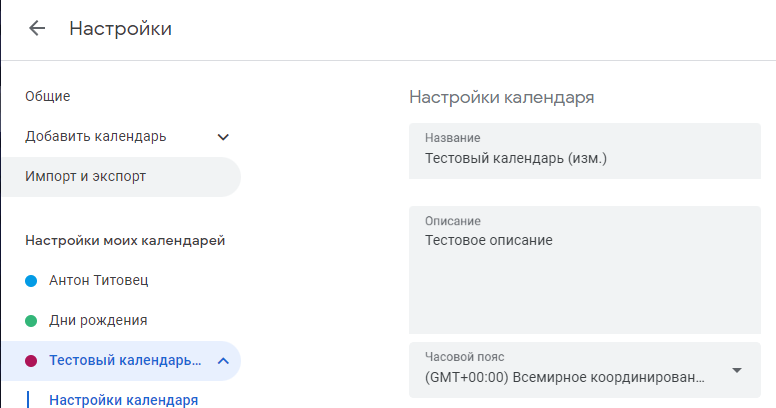

# Изменить метаданные календаря
Изменяет поля метаданных календаря

*Функция ИзменитьМетаданныеКалендаря(Знач Токен, Знач Календарь, Знач Наименование = "", Знач Описание = "") Экспорт*

  | Параметр | Тип | Назначение |
  |-|-|-|
  | Токен | Строка | Токен доступа |
  | Календарь | Строка | ID календаря для изменения |
  | Наименование | Строка (необяз.) | Новое наименование календаря |
  | Описание | Строка (необяз.) | Новое описание календаря |
  
  Вовзращаемое значение: Соответствие - сериализованный JSON ответа от Google

```bsl title="Пример кода"
			
    Наименование = "Тестовый календарь (изм.)";
    Описание     = "Тестовое описание";
    Ответ        = OPI_GoogleCalendar.ИзменитьМетаданныеКалендаря(Токен, "55868c32be16935f0...", Наименование, Описание); //Соответствие
    Ответ        = OPI_Инструменты.JSONСтрокой(Ответ);                                                                    //Строка

```



```json title="Результат"

{
 "conferenceProperties": {
  "allowedConferenceSolutionTypes": [
   "hangoutsMeet"
  ]
 },
 "description": "Тестовое описание",
 "summary": "Тестовый календарь (изм.)",
 "timeZone": "UTC",
 "id": "75b64bec8700a640b004af3491867ac5e479884794f529699da23e7009f7d691@group.calendar.google.com",
 "etag": "\"x8eLqpmgoxpEDEXmEbsZxxgmJhc\"",
 "kind": "calendar#calendar"
}

```
