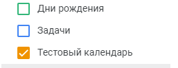

# Создать календарь
Создает новый календарь

*Функция СоздатьКалендарь(Знач Токен, Знач Наименование) Экспорт*

  | Параметр | Тип | Назначение |
  |-|-|-|
  | Токен | Строка | Токен доступа |
  | Наименование | Строка | Наименование создаваемого календаря |
  
  Вовзращаемое значение: Соответствие - сериализованный JSON ответа от Google

```bsl title="Пример кода"
			
    Ответ = OPI_GoogleCalendar.СоздатьКалендарь(Токен, "Тестовый календарь"); //Соответствие
    Ответ = OPI_Инструменты.JSONСтрокой(Ответ);                               //Строка

```



```json title="Результат"

{
 "conferenceProperties": {
  "allowedConferenceSolutionTypes": [
   "hangoutsMeet"
  ]
 },
 "summary": "Тестовый календарь",
 "timeZone": "UTC",
 "id": "75b64bec8700a640b004af3491867ac5e479884794f529699da23e7009f7d691@group.calendar.google.com",
 "etag": "\"ZlOrbHnYjwJB0APkTQupgFm7F3s\"",
 "kind": "calendar#calendar"
}

```
