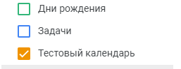

# Добавить календарь в список
Добавляет календарь в список календарей пользователя

*Функция ДобавитьКалендарьВСписок(Знач Токен, Знач Календарь) Экспорт*

  | Параметр | Тип | Назначение |
  |-|-|-|
  | Токен | Строка | Токен доступа |
  | Календарь | Строка | ID календаря для добавления |
  
  Вовзращаемое значение: Соответствие - сериализованный JSON ответа от Google

```bsl title="Пример кода"
			
    Ответ = OPI_GoogleCalendar.ДобавитьКалендарьВСписок(Токен, "55868c32be16935f0..."); //Соответствие
    Ответ = OPI_Инструменты.JSONСтрокой(Ответ);                                         //Строка

```



```json title="Результат"

{
 "conferenceProperties": {
  "allowedConferenceSolutionTypes": [
   "hangoutsMeet"
  ]
 },
 "accessRole": "owner",
 "selected": true,
 "foregroundColor": "#000000",
 "backgroundColor": "#7bd148",
 "colorId": "9",
 "description": "Тестовое описание",
 "summary": "Тестовый календарь (изм.)",
 "defaultReminders": [],
 "timeZone": "UTC",
 "id": "f0fad8c7db43ef0adb71cbf035eb08cf80d8f8d51ba31fa86f4d5680dc2e9725@group.calendar.google.com",
 "etag": "\"1708423365033000\"",
 "kind": "calendar#calendarListEntry"
}

```
