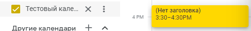

# Изменить календарь списка
Изменяет данные календаря из списка календарей пользователя

*Функция ИзменитьКалендарьСписка(Знач Токен, Знач Календарь, Знач ОсновнойЦвет, Знач ДополнительныйЦвет, Знач Скрытый = Ложь) Экспорт*

  | Параметр | Тип | Назначение |
  |-|-|-|
  | Токен | Строка | Токен доступа |
  | Календарь | Строка | ID календаря для добавления |
  | ОсновнойЦвет | Строка | HEX основного цвета (цвета шрифта) в формате #ffffff |
  | ДополнительныйЦвет | Строка | HEX дополнительного цвета (цвета фона) в формате #ffffff |
  | Скрытый | Булево (необяз.) | Признак скрытости календаря |
  
  Вовзращаемое значение: Соответствие - сериализованный JSON ответа от Google

```bsl title="Пример кода"
			

    Черный = "#000000";
    Желтый = "#ffd800";

    Ответ  = OPI_GoogleCalendar.ИзменитьКалендарьСписка(Токен, "55868c32be16935f0...", Черный, Желтый, Ложь); //Соответствие
    Ответ  = OPI_Инструменты.JSONСтрокой(Ответ);                                                              //Строка

```



```json title="Результат"

{
 "conferenceProperties": {
  "allowedConferenceSolutionTypes": [
   "hangoutsMeet"
  ]
 },
 "accessRole": "owner",
 "foregroundColor": "#000000",
 "backgroundColor": "#ffd800",
 "colorId": "6",
 "description": "Тестовое описание",
 "summary": "Тестовый календарь (изм.)",
 "defaultReminders": [],
 "timeZone": "UTC",
 "id": "0da65d69eba1e4b27f980447827b251ca2d94ecb1d30dba22c83559c33d0ea29@group.calendar.google.com",
 "etag": "\"1708424005038000\"",
 "kind": "calendar#calendarListEntry"
}

```
