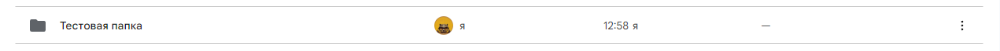

# Создать папку
Создает пустой каталог

*Функция СоздатьПапку(Знач Токен, Знач Имя, Знач Родитель = "") Экспорт*

  | Параметр | CLI | Тип | Назначение |
  |-|-|-|-|
  | Токен | --token | Строка | Токен доступа |
  | Имя | --title | Строка | Имя нового каталога |
  | Родитель | --catalog | Строка | ID родительского каталога (по умолчанию - корень) |
  
  Вовзращаемое значение: Соответствие - сериализованный JSON ответа от Google

```bsl title="Пример кода"
			
    Имя = "Тестовая папка";
 
    Ответ = OPI_GoogleDrive.СоздатьПапку(Токен, Имя);  //Соответствие
    Ответ = OPI_Инструменты.JSONСтрокой(Ответ);        //Строка

```



```json title="Результат"

{
 "mimeType": "application/vnd.google-apps.folder",
 "name": "Тестовая папка",
 "id": "1fIqr5pJV3QybT5sPeZhBD_0TIvtL5Ovc",
 "kind": "drive#file"
}

```
