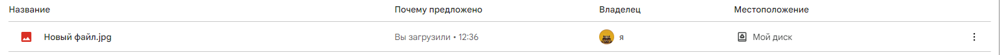

# Загрузить файл
Загружает двоичные данные файла на Google Drive

*Функция ЗагрузитьФайл(Знач Токен, Знач Файл, Знач Описание) Экспорт*

  | Параметр | CLI опция | Тип | Назначение |
  |-|-|-|-|
  | Токен | --token | Строка | Токен доступа |
  | Файл | --file | ДвоичныеДанные,Строка | Двоичные данные или путь к файлу |
  | Описание | --props | Соответствие | Описание файла. См. [ПолучитьОписаниеФайла](./Poluchit-opisanye-fayla) |
  
  Вовзращаемое значение: Соответствие - сериализованный JSON ответа от Google

```bsl title="Пример кода"
			
    Описание = Новый Соответствие;
    Описание.Вставить("MIME"        , "image/jpeg");
    Описание.Вставить("Имя"         , "Новый файл.jpg");
    Описание.Вставить("Описание"    , "Это новый файл");
    Описание.Вставить("Родитель"    , "root");

    Картинка = "C:\OPI\image.jpg";
 
    Ответ = OPI_GoogleDrive.ЗагрузитьФайл(Токен, Картинка, Описание);  //Соответствие
    Ответ = OPI_Инструменты.JSONСтрокой(Ответ);                        //Строка

```

```sh title="Пример команд CLI"

    Структура JSON данных объекта (параметр --props):
    {
     "MIME"        , "image/jpeg",
     "Имя"         , "Новый файл.jpg",
     "Описание"    , "Это новый файл",
     "Родитель"    , "root"
    }

    ---------------------------

    oint google ОбновитьТокен --id %clientid% --secret %clientsecret% --refresh %refreshtoken% > token.json
    oint tools РазложитьJSON --json token.json --name access_token > token.tmp
    set /p token=<token.tmp
    oint gdrive ЗагрузитьФайл --token "%token%" --file "C:\OPI\image.jpg" --props props.json

```



```json title="Результат"

{
 "mimeType": "image/jpeg",
 "name": "Новый файл.jpg",
 "id": "16hPGNTMmbnXhz_g0vjGbrLP19h56RwIg",
 "kind": "drive#file"
}

```
