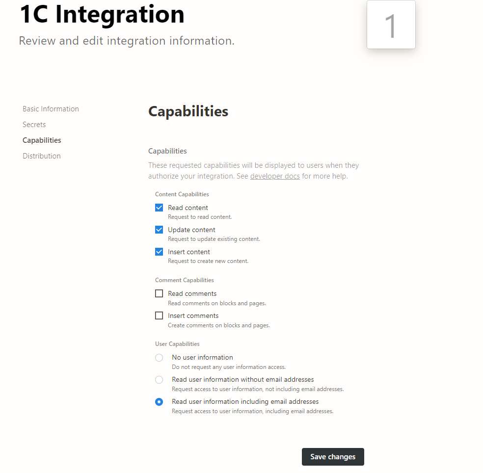

# Получить данные пользователя
Получает данные пользователя по ID


*Функция ПолучитьДанныеПользователя(Знач Токен, Знач ИДПользователя) Экспорт*

  | Параметр | CLI опция | Тип | Назначение |
  |-|-|-|-|
  | Токен | --token | Строка | Токен интеграции |
  | ИДПользователя | --user | Строка | ID целевого пользователя |
  
  Вовзращаемое значение: Соответствие - сериализованный JSON ответа от Notion

```bsl title="Пример кода"
	
  Токен          = "secret_9RsfMrRMqZwqp0Zl0B...";
  ИДПользователя = "ed71865a989146bc86cdwdf24...";

  Ответ = OPI_Notion.ПолучитьДанныеПользователя(Токен, ИДПользователя);
  Ответ = OPI_Инструменты.JSONСтрокой(Ответ);                                             
	
```

```json title="Результат"

{
 "request_id": "f33d34a8-f3cf-41b5-bdf5-4a07cf7d7118",
 "person": {
  "email": "ex@gmail.com"
 },
 "type": "person",
 "avatar_url": null,
 "name": "Bayselonarrend",
 "id": "ed71865a-9891-1111-86cd-1111111",
 "object": "user"
}

```

### Если нет прав на получение данных ###
То их нужно добавить в настройках интеграции на [https://developers.notion.com](https://developers.notion.com) (View my integrations в правом верхнем углу)


