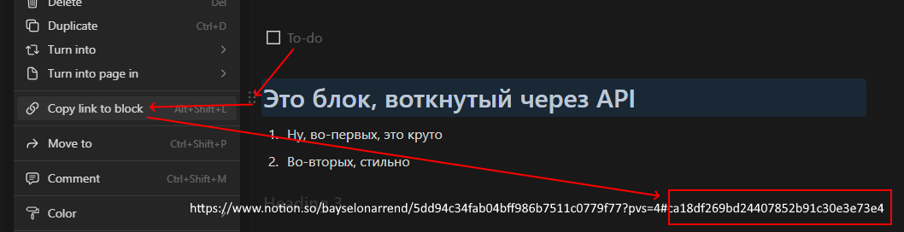
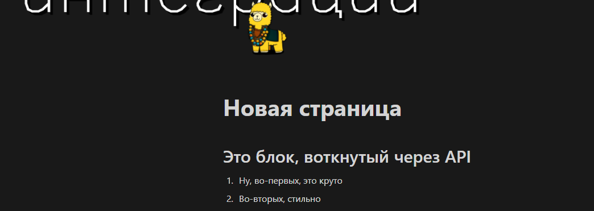

# Создать блок
Создает блок внутри страницы на основе другого, заранее созданного, блока

*Функция СоздатьБлок(Знач Токен, Знач Родитель, Знач Блок, Знач ВставитьПосле = "") Экспорт*

  | Параметр | Тип | Назначение |
  |-|-|-|
  | Токен | Строка | Токен интеграции |
  | Родитель | Строка | ID страницы, на которую необходимо вставить блок |
  | Блок | Строка,Соответствие | ID блока-образца, который необходимо скопировать на страницу или сам блок в виде соответствия|
  | ВставитьПосле | Строка (необяз.) | ID блока, после которого необходимо вставить новый (для страниц с несколькими дочерними блоками, если необходимо) |
  
  Вовзращаемое значение: Соответствие - сериализованный JSON ответа от Notion

```bsl title="Пример кода"
	
  Токен     = "secret_9RsfMrRMqZwqp0Zl0B...";
  Родитель  = "5dd94c34fab04bff9...";

  Блок      = OPI_Notion.ВернутьБлок(Токен, "ca18df269bd24407852b91c30e...");       //Блок как соответствие. С ним можно свершать манипуляции.

  Ответ = OPI_Notion.СоздатьБлок(Токен, Родитель, Блок);                            //Заголовок: Это блок, воткнутый через API
  Ответ = OPI_Notion.СоздатьБлок(Токен, Родитель, "46c1500ed40c4e89ba6a229003..."); //1. Ну, во-первых, это круто
  Ответ = OPI_Notion.СоздатьБлок(Токен, Родитель, "aa4137d4c8cc445d9f969c3968..."); //2. Во-вторых, стильно
  Ответ = OPI_Инструменты.JSONСтрокой(Ответ);                                          
	
```
<br/>
### Как получить ID блока? ###




<hr/>
<br/><br/>



```json title="Результат"

{
 "request_id": "4de46f5b-d38b-4df5-b26e-32127db1096b",
 "block": {},
 "type": "block",
 "has_more": false,
 "next_cursor": null,
 "results": [
  {
   "type": "numbered_list_item",
   "archived": false,
   "created_by": {
    "id": "8b07422e-eeea-40d1-8d5e-c784211825b0",
    "object": "user"
   },
   "last_edited_time": "2024-01-26T17:11:00.000Z",
   "created_time": "2024-01-26T17:11:00.000Z",
   "has_children": false,
   "parent": {
    "page_id": "5dd94c34-fab0-4bff-986b-7511c0779f77",
    "type": "page_id"
   },
   "last_edited_by": {
    "id": "8b07422e-eeea-40d1-8d5e-c784211825b0",
    "object": "user"
   },
   "id": "b147fabd-53ea-42d5-bd23-85968f627f88",
   "numbered_list_item": {
    "color": "default",
    "rich_text": [
     {
      "plain_text": "Во-вторых, стильно",
      "annotations": {
       "color": "default",
       "code": false,
       "underline": false,
       "strikethrough": false,
       "italic": false,
       "bold": false
      },
      "text": {
       "link": null,
       "content": "Во-вторых, стильно"
      },
      "href": null,
      "type": "text"
     }
    ]
   },
   "object": "block"
  }
 ],
 "object": "list"
}

```
