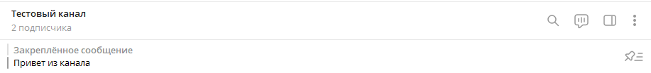

# Закрепить сообщение
Закрепляет сообщение в шапке чата


*Функция ЗакрепитьСообщение(Знач Токен, Знач IDЧата, Знач IDСообщения) Экспорт*

  | Параметр | Тип | Назначение |
  |-|-|-|
  | Токен | Строка | Токен бота |
  | IDЧата | Строка/Число | ID целевого чата |
  | IDСообщения | Строка/Число | ID целевого сообщения |
  
  Вовзращаемое значение: Соответствие - сериализованный JSON ответа от Telegram

```bsl title="Пример кода"
	
	Токен = "111111111:AACccNYOAFbuhAL5GAaaBbbbOjZYFvLZZZZ";
	
	Ответ = OPI_Telegram.ЗакрепитьСообщение(Токен, "@testsichee", 212); //Соответствие
	Ответ = OPI_Инструменты.JSONСтрокой(Ответ);                         //JSON строка                                            
	
```



```json title="Результат"

{
 "result": true,
 "ok": true
}

```