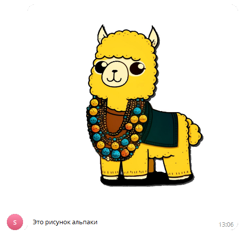

# Отправить картинку
Отправляет картинку в чат или канал


*Функция ОтправитьКартинку(Знач Токен, Знач IDЧата, Знач Текст, Знач Картинка, Знач Клавиатура = "") Экспорт*

  | Параметр | Тип | Назначение |
  |-|-|-|
  | Токен | Строка | Токен бота |
  | IDЧата | Строка/Число | ID целевого чата |
  | Текст | Строка | Текст сообщения |
  | Картинка | Двоичные данные / Строка | Двоичные данные картинки или путь к файлу |
  | Клавиатура | Строка (необяз.) | JSON клавиатуры. См. [Сформировать клавиатуру по массиву кнопок](./Sformirovat-klaviaturu-po-massivu-knopok) |
  
  Вовзращаемое значение: Соответствие - сериализованный JSON ответа от Telegram


```bsl title="Пример кода"
	
	Токен          = "111111111:AACccNYOAFbuhAL5GAaaBbbbOjZYFvLZZZZ";
	Описание       = "Это рисунок альпаки";
	ПутьККартинке  = "C:\alpaca.png";
	
	Ответ = OPI_Telegram.ОтправитьКартинку(Токен, 1234567890, Описание, ПутьККартинке); //Соответствие
	Ответ = OPI_Инструменты.JSONСтрокой(Ответ);                                         //JSON строка                                            
	
```



```json title="Результат"

{
 "result": {
  "caption": "Это рисунок альпаки",
  "photo": [
   {
    "height": 90,
    "width": 90,
    "file_size": 1613,
    "file_unique_id": "AQADftIxG2MAAXlIeA",
    "file_id": "AgACAgIAAxkDAAMVZZkmU46YcTQFph55JuPPtTh-o_oAAn7SMRtjAAF5SCkLE2kgkDKPAQADAgADcwADNAQ"
   },
   {
    "height": 320,
    "width": 320,
    "file_size": 18195,
    "file_unique_id": "AQADftIxG2MAAXlIcg",
    "file_id": "AgACAgIAAxkDAAMVZZkmU46YcTQFph55JuPPtTh-o_oAAn7SMRtjAAF5SCkLE2kgkDKPAQADAgADbQADNAQ"
   },
   {
    "height": 800,
    "width": 800,
    "file_size": 70046,
    "file_unique_id": "AQADftIxG2MAAXlIfQ",
    "file_id": "AgACAgIAAxkDAAMVZZkmU46YcTQFph55JuPPtTh-o_oAAn7SMRtjAAF5SCkLE2kgkDKPAQADAgADeAADNAQ"
   },
   {
    "height": 1024,
    "width": 1024,
    "file_size": 94427,
    "file_unique_id": "AQADftIxG2MAAXlIfg",
    "file_id": "AgACAgIAAxkDAAMVZZkmU46YcTQFph55JuPPtTh-o_oAAn7SMRtjAAF5SCkLE2kgkDKPAQADAgADeQADNAQ"
   }
  ],
  "date": 1704535635,
  "chat": {
   "username": "JKIee",
   "type": "private",
   "last_name": "Titowets",
   "first_name": "Anton",
   "id": 1234567890
  },
  "from": {
   "username": "sicheebot",
   "first_name": "Sichee",
   "is_bot": true,
   "id": 0987654321
  },
  "message_id": 21
 },
 "ok": true
}

```
