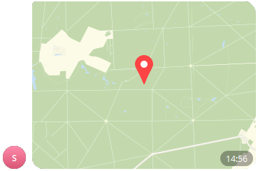

# Отправить местоположение
Отправляет местоположение по географической широте и долготе в чат или канал


*Функция ОтправитьМестоположение(Знач Токен, Знач IDЧата, Знач Широта, Знач Долгота, Знач Клавиатура = "") Экспорт*

  | Параметр | CLI опция | Тип | Назначение |
  |-|-|-|-|
  | Токен | --token | Строка | Токен бота |
  | IDЧата | --chat | Строка/Число | ID целевого чата. Если необходима отправка в определенную тему, её номер нужно указывать через * (IDЧата*IDТемы) |
  | Широта | --lat | Строка/Число | Географическая широта |
  | Долгота | --long | Строка/Число | Географическая долгота |
  | Клавиатура | --keyboard | Строка (необяз.) | JSON клавиатуры. См. [Сформировать клавиатуру по массиву кнопок](./Sformirovat-klaviaturu-po-massivu-knopok) |
  
  Вовзращаемое значение: Соответствие - сериализованный JSON ответа от Telegram


```bsl title="Пример кода"
	
	Токен = "111111111:AACccNYOAFbuhAL5GAaaBbbbOjZYFvLZZZZ";
	
	Ответ = OPI_Telegram.ОтправитьМестоположение(Токен, 1234567890, 48.87373649724122, 2.2954639195323967);  //Соответствие
	Ответ = OPI_Инструменты.JSONСтрокой(Ответ);                                                              //JSON строка
	
```



```json title="Результат"

{
 "result": {
  "location": {
   "longitude": 1.999986,
   "latitude": 48.00001
  },
  "date": 1704542212,
  "chat": {
   "username": "JKIee",
   "type": "private",
   "last_name": "Titowets",
   "first_name": "Anton",
   "id": 1234567890
  },
  "from": {
   "username": "sicheebot",
   "first_name": "Sichee",
   "is_bot": true,
   "id": 0987654321
  },
  "message_id": 29
 },
 "ok": true
}

```
