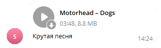

# Отправить аудио
Отправляет аудиофайл в чат или канал


*Функция ОтправитьАудио(Знач Токен, Знач IDЧата, Знач Текст, Знач Аудио, Знач Клавиатура = "") Экспорт*

  | Параметр | Тип | Назначение |
  |-|-|-|
  | Токен | Строка | Токен бота |
  | IDЧата | Строка/Число | ID целевого чата |
  | Текст | Строка | Текст сообщения |
  | Аудио | Двоичные данные / Строка | Двоичные данные аудио или путь к файлу |
  | Клавиатура | Строка (необяз.) | JSON клавиатуры. См. [Сформировать клавиатуру по массиву кнопок](./%D0%A1%D1%84%D0%BE%D1%80%D0%BC%D0%B8%D1%80%D0%BE%D0%B2%D0%B0%D1%82%D1%8C%20%D0%BA%D0%BB%D0%B0%D0%B2%D0%B8%D0%B0%D1%82%D1%83%D1%80%D1%83%20%D0%BF%D0%BE%20%D0%BC%D0%B0%D1%81%D1%81%D0%B8%D0%B2%D1%83%20%D0%BA%D0%BD%D0%BE%D0%BF%D0%BE%D0%BA) |
  
  Вовзращаемое значение: Соответствие - сериализованный JSON ответа от Telegram


```bsl title="Пример кода"
	
	Токен       = 111111111:AACccNYOAFbuhAL5GAaaBbbbOjZYFvLZZZZ;
	Описание    = "Крутая песня";
	ПутьКПесне  = "C:\song.mp3";
	
	Ответ = OPI_Telegram.ОтправитьАудио(Токен, 1234567890, Описание, ПутьКПесне); //Соответствие
	Ответ = OPI_Инструменты.JSONСтрокой(Ответ);                                   //JSON строка                                            
	
```



```json title="Результат"

{
 "result": {
  "caption": "Крутая песня",
  "audio": {
   "file_size": 9229352,
   "file_id": "CQACAgIAAxkDAAMZZZk4hgQeno7HIq5rbfhqofcfr6AAAog8AAIG99FI8QhH6WO7rcI0BA",
   "performer": "Motorhead",
   "title": "Dogs",
   "mime_type": "audio/mpeg",
   "file_name": "audio",
   "file_unique_id": "AgADiDwAAgb30Ug",
   "duration": 228
  },
  "date": 1704540294,
  "chat": {
   "username": "JKIee",
   "type": "private",
   "last_name": "Titowets",
   "first_name": "Anton",
   "id": 1234567890
  },
  "from": {
   "username": "sicheebot",
   "first_name": "Sichee",
   "is_bot": true,
   "id": 0987654321
  },
  "message_id": 25
 },
 "ok": true
}

```
