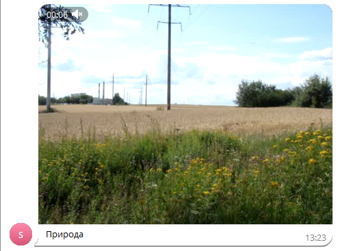

# Отправить видео
Отправляет видео в чат или канал


*Функция ОтправитьВидео(Знач Токен, Знач IDЧата, Знач Текст, Знач Видео, Знач Клавиатура = "") Экспорт*

  | Параметр | Тип | Назначение |
  |-|-|-|
  | Токен | Строка | Токен бота |
  | IDЧата | Строка/Число | ID целевого чата |
  | Текст | Строка | Текст сообщения |
  | Видео | Двоичные данные / Строка | Двоичные данные видео или путь к файлу **(формат - MP4)** |
  | Клавиатура | Строка (необяз.) | JSON клавиатуры. См. [Сформировать клавиатуру по массиву кнопок](./%D0%A1%D1%84%D0%BE%D1%80%D0%BC%D0%B8%D1%80%D0%BE%D0%B2%D0%B0%D1%82%D1%8C%20%D0%BA%D0%BB%D0%B0%D0%B2%D0%B8%D0%B0%D1%82%D1%83%D1%80%D1%83%20%D0%BF%D0%BE%20%D0%BC%D0%B0%D1%81%D1%81%D0%B8%D0%B2%D1%83%20%D0%BA%D0%BD%D0%BE%D0%BF%D0%BE%D0%BA) |
  
  Вовзращаемое значение: Соответствие - сериализованный JSON ответа от Telegram


```bsl title="Пример кода"
	
	Токен       = "111111111:AACccNYOAFbuhAL5GAaaBbbbOjZYFvLZZZZ";
	Описание    = "Природа";
	ПутьКВидео  = "C:\video.mp4";
	
	Ответ = OPI_Telegram.ОтправитьВидео(Токен, 1234567890, Описание, ПутьКВидео); //Соответствие
	Ответ = OPI_Инструменты.JSONСтрокой(Ответ);                                   //JSON строка                                            
	
```



```json title="Результат"

{
 "result": {
  "caption": "Природа",
  "video": {
   "file_size": 4057213,
   "file_id": "BAACAgIAAxkDAAMWZZkqV2M0extEs35nt26fVjfzvScAAgs-AAIG98lISPM63NtOju00BA",
   "thumb": {
    "height": 240,
    "width": 320,
    "file_size": 19154,
    "file_unique_id": "AQADCz4AAgb3yUhy",
    "file_id": "AAMCAgADGQMAAxZlmSpXYzR7G0Szfme3bp9WN_O9JwACCz4AAgb3yUhI8zrc206O7QEAB20AAzQE"
   },
   "thumbnail": {
    "height": 240,
    "width": 320,
    "file_size": 19154,
    "file_unique_id": "AQADCz4AAgb3yUhy",
    "file_id": "AAMCAgADGQMAAxZlmSpXYzR7G0Szfme3bp9WN_O9JwACCz4AAgb3yUhI8zrc206O7QEAB20AAzQE"
   },
   "height": 480,
   "mime_type": "video/mp4",
   "file_name": "video",
   "width": 640,
   "file_unique_id": "AgADCz4AAgb3yUg",
   "duration": 9
  },
  "date": 1704536663,
  "chat": {
   "username": "JKIee",
   "type": "private",
   "last_name": "Titowets",
   "first_name": "Anton",
   "id": 1234567890
  },
  "from": {
   "username": "sicheebot",
   "first_name": "Sichee",
   "is_bot": true,
   "id": 0987654321
  },
  "message_id": 22
 },
 "ok": true
}

```
