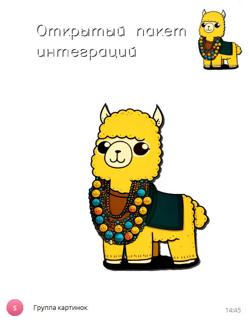

# Отправить группу медиафайлов
Отправляет набор файлов в чат или канал


*Функция ОтправитьМедиагруппу(Знач Токен, Знач IDЧата, Знач Текст, Знач СоответствиеФайлов, Знач Клавиатура = "") Экспорт*

  | Параметр | Тип | Назначение |
  |-|-|-|
  | Токен | Строка | Токен бота |
  | IDЧата | Строка/Число | ID целевого чата |
  | Текст | Строка | Текст сообщения |
  | СоответствиеФайлов | Соответствие из Строка | Ключ - двоичные данны или путь к файлу, Значение - тип медиафайла См.ОтправитьФайл |
  | Клавиатура | Строка (необяз.) | JSON клавиатуры. См. [Сформировать клавиатуру по массиву кнопок](./%D0%A1%D1%84%D0%BE%D1%80%D0%BC%D0%B8%D1%80%D0%BE%D0%B2%D0%B0%D1%82%D1%8C%20%D0%BA%D0%BB%D0%B0%D0%B2%D0%B8%D0%B0%D1%82%D1%83%D1%80%D1%83%20%D0%BF%D0%BE%20%D0%BC%D0%B0%D1%81%D1%81%D0%B8%D0%B2%D1%83%20%D0%BA%D0%BD%D0%BE%D0%BF%D0%BE%D0%BA) |
  
  Вовзращаемое значение: Соответствие - сериализованный JSON ответа от Telegram


```bsl title="Пример кода"
	
	Токен              = "111111111:AACccNYOAFbuhAL5GAaaBbbbOjZYFvLZZZZ";
	Описание           = "Группа картинок";
	СоответствиеФайлов = Новый Соответствие;
	СоответствиеФайлов.Вставить("C:\OPI\alpaca.png"     , "photo");
	СоответствиеФайлов.Вставить("C:\OPI\alpaca_text.png", "photo");

	Ответ = OPI_Telegram.ОтправитьМедиагруппу(Токен, 1234567890, Описание, СоответствиеФайлов); //Соответствие
	Ответ = OPI_Инструменты.JSONСтрокой(Ответ_);                                                //JSON строка                                            

```



```json title="Результат"

{
 "result": [
  {
   "caption": "Группа картинок",
   "photo": [
    {
     "height": 30,
     "width": 90,
     "file_size": 787,
     "file_unique_id": "AQADf9IxG2MAAXlIeA",
     "file_id": "AgACAgIAAxkDAAMbZZk9eS2GElIQ6qEvNoT3lpWJ1tEAAn_SMRtjAAF5SCTtUEGq6AwJAQADAgADcwADNAQ"
    },
    {
     "height": 106,
     "width": 320,
     "file_size": 7080,
     "file_unique_id": "AQADf9IxG2MAAXlIcg",
     "file_id": "AgACAgIAAxkDAAMbZZk9eS2GElIQ6qEvNoT3lpWJ1tEAAn_SMRtjAAF5SCTtUEGq6AwJAQADAgADbQADNAQ"
    },
    {
     "height": 266,
     "width": 800,
     "file_size": 25565,
     "file_unique_id": "AQADf9IxG2MAAXlIfQ",
     "file_id": "AgACAgIAAxkDAAMbZZk9eS2GElIQ6qEvNoT3lpWJ1tEAAn_SMRtjAAF5SCTtUEGq6AwJAQADAgADeAADNAQ"
    },
    {
     "height": 426,
     "width": 1280,
     "file_size": 49308,
     "file_unique_id": "AQADf9IxG2MAAXlIfg",
     "file_id": "AgACAgIAAxkDAAMbZZk9eS2GElIQ6qEvNoT3lpWJ1tEAAn_SMRtjAAF5SCTtUEGq6AwJAQADAgADeQADNAQ"
    },
    {
     "height": 853,
     "width": 2560,
     "file_size": 120918,
     "file_unique_id": "AQADf9IxG2MAAXlIfA",
     "file_id": "AgACAgIAAxkDAAMbZZk9eS2GElIQ6qEvNoT3lpWJ1tEAAn_SMRtjAAF5SCTtUEGq6AwJAQADAgADdwADNAQ"
    }
   ],
   "media_group_id": "13636332495269186",
   "date": 1704541561,
   "chat": {
    "username": "JKIee",
    "type": "private",
    "last_name": "Titowets",
    "first_name": "Anton",
    "id": 1234567890
   },
   "from": {
    "username": "sicheebot",
    "first_name": "Sichee",
    "is_bot": true,
    "id": 0987654321
   },
   "message_id": 27
  },
  {
   "photo": [
    {
     "height": 90,
     "width": 90,
     "file_size": 1613,
     "file_unique_id": "AQADftIxG2MAAXlIeA",
     "file_id": "AgACAgIAAxkDAAMcZZk9efFf-ZNjFTRxpkGahrDPv_0AAn7SMRtjAAF5SCkLE2kgkDKPAQADAgADcwADNAQ"
    },
    {
     "height": 320,
     "width": 320,
     "file_size": 18195,
     "file_unique_id": "AQADftIxG2MAAXlIcg",
     "file_id": "AgACAgIAAxkDAAMcZZk9efFf-ZNjFTRxpkGahrDPv_0AAn7SMRtjAAF5SCkLE2kgkDKPAQADAgADbQADNAQ"
    },
    {
     "height": 800,
     "width": 800,
     "file_size": 70046,
     "file_unique_id": "AQADftIxG2MAAXlIfQ",
     "file_id": "AgACAgIAAxkDAAMcZZk9efFf-ZNjFTRxpkGahrDPv_0AAn7SMRtjAAF5SCkLE2kgkDKPAQADAgADeAADNAQ"
    },
    {
     "height": 1024,
     "width": 1024,
     "file_size": 94427,
     "file_unique_id": "AQADftIxG2MAAXlIfg",
     "file_id": "AgACAgIAAxkDAAMcZZk9efFf-ZNjFTRxpkGahrDPv_0AAn7SMRtjAAF5SCkLE2kgkDKPAQADAgADeQADNAQ"
    }
   ],
   "media_group_id": "13636332495269186",
   "date": 1704541561,
   "chat": {
    "username": "JKIee",
    "type": "private",
    "last_name": "Titowets",
    "first_name": "Anton",
    "id": 1234567890
   },
   "from": {
    "username": "sicheebot",
    "first_name": "Sichee",
    "is_bot": true,
    "id": 0987654321
   },
   "message_id": 28
  }
 ],
 "ok": true
}

```
