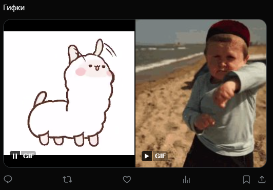

# Создать твит с гифкой
Создает твит с гифкой


Функция СоздатьТвитГифки(Знач Текст, Знач МассивГифок, Знач Параметры = "") Экспорт

  | Параметр | CLI опция | Тип | Назначение |
  |-|-|-|-|
  | Текст | --text | Строка | Текст твита |
  | МассивГифок | --gifs | Массив из Строка, Двоичные данные | Массив двоичных данных или путей к гифкам |
  | Параметры | --auth | Структура (необяз.) | Параметры / перезапись стандартных параметров (см. [Получение необходимых данных](../)) |
  
  Вовзращаемое значение: Соответствие - сериализованный JSON ответа от Telegram


```bsl title="Пример кода"
	
	МассивКартинок = Новый Массив;
	МассивКартинок.Добавить("C:\1.gif");
	МассивКартинок.Добавить("C:\2.gif");

	Ответ = OPI_Twitter.СоздатьТвитГифки("Гифки", МассивКартинок, Параметры);
	Ответ = OPI_Инструменты.JSONСтрокой(Ответ);
	
```

```sh title="Пример команд CLI"

    oint twitter СоздатьТвитГифки --text "Гифки" --gifs "['C:\1.gif','C:\2.gif']" --auth C:\twitter.json

```



```json title="Результат"

{
 "data": {
  "text": "Природа https://t.co/VWkWU11111",
  "id": "1746086669499924991",
  "edit_history_tweet_ids": [
   "1746086669499924991"
  ]
 }
}

```
