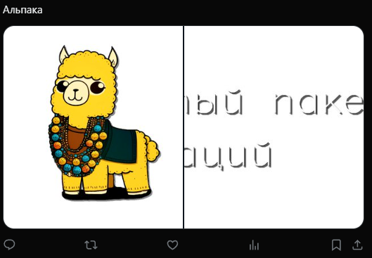

# Создать твит с картинкой
Создает твит с картинкой


Функция СоздатьТвитКартинки(Знач Текст, Знач МассивКартинок, Знач Параметры = "") Экспорт

  | Параметр | CLI опция | Тип | Назначение |
  |-|-|-|-|
  | Текст | --text | Строка | Текст твита |
  | МассивКартинок | --pictures | Массив из Строка, Двоичные данные | Массив двоичных данных или путей к картинкам |
  | Параметры | --auth | Структура (необяз.) | Параметры / перезапись стандартных параметров (см. [Получение необходимых данных](../)) |
  
  Вовзращаемое значение: Соответствие - сериализованный JSON ответа от Telegram


```bsl title="Пример кода"
	
	МассивКартинок = Новый Массив;
	МассивКартинок.Добавить("C:\logo.png");
	МассивКартинок.Добавить("C:\logo_long.png");

	Ответ = OPI_Twitter.СоздатьТвитКартинки("Альпака", МассивКартинок, Параметры);
	Ответ = OPI_Инструменты.JSONСтрокой(Ответ);
	
```



```json title="Результат"

{
 "data": {
  "text": "Альпака https://t.co/OodoWT1AAA",
  "id": "1745753004542726629",
  "edit_history_tweet_ids": [
   "1745753004542726629"
  ]
 }
}

```
