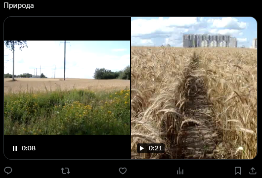

# Создать твит с видео
Создает твит с видео


Функция СоздатьТвитВидео(Знач Текст, Знач МассивВидео, Знач Параметры = "") Экспорт

  | Параметр | Тип | Назначение |
  |-|-|-|
  | Текст | Строка | Текст твита |
  | МассивВидео | Массив из Строка, Двоичные данные | Массив двоичных данных или путей к видео |
  | Параметры | Структура (необяз.) | Параметры / перезапись стандартных параметров (см. [Получение необходимых данных](../)) |
  
  Вовзращаемое значение: Соответствие - сериализованный JSON ответа от Telegram


```bsl title="Пример кода"
	
	МассивКартинок = Новый Массив;
	МассивКартинок.Добавить("C:\1.mp4");
	МассивКартинок.Добавить("C:\2.mp4");

	Ответ = OPI_Twitter.СоздатьТвитВидео("Природа", МассивКартинок, Параметры);
	Ответ = OPI_Инструменты.JSONСтрокой(Ответ);
	
```



```json title="Результат"

{
 "data": {
  "text": "Альпака https://t.co/OodoWT1AAA",
  "id": "1745753004542726629",
  "edit_history_tweet_ids": [
   "1745753004542726629"
  ]
 }
}

```
