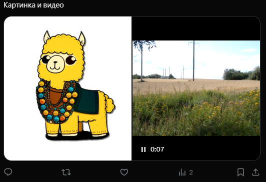

# Создать произвольный твит
Создает твит с произвольным набором ID медиа или вариантами опроса. Служит основой для остальных функций создания твитов


Функция СоздатьПроизвольныйТвит(Знач Текст = "", Знач МассивМедиа = "", Знач МассивВариантовОпроса = "", Знач ДлительностьОпроса = "", Знач Параметры = "") Экспорт 


  | Параметр | Тип | Назначение |
  |-|-|-|
  | Текст | Строка | Текст твита |
  | МассивМедиа | Массив из Строка (необяз.) | Массив из ID медиа, загруженных на Twitter |
  | МассивВариантовОпроса | Массив из Строка (необяз.) | Массив вариантов опроса. Нельзя использовать, если есть загрузка медиа |
  | ДлительностьОпроса | Строка, Число (необяз.) | Длительность опроса в минутах. Обязательна, если есть варианты опроса |
  | Параметры | Структура (необяз.) | Параметры / перезапись стандартных параметров (см. [Получение необходимых данных](../)) |
  
  Вовзращаемое значение: Соответствие - сериализованный JSON ответа от Telegram


```bsl title="Пример кода"
	
	МассивМедиа    = Новый Массив;
	МассивКартинок = OPI_Twitter.ЗагрузитьМассивВложений("C:\GDrive\Мой диск\Проекты\ОПИ\logo.png", "tweet_image", Параметры_);
	МассивВидео    = OPI_Twitter.ЗагрузитьМассивВложений("C:\GDrive\Мой диск\Проекты\ОПИ\video.mp4", "tweet_video", Параметры_);
	
	МассивМедиа.Добавить(МассивКартинок[0]);
	МассивМедиа.Добавить(МассивВидео[0]);
	
	Ответ = OPI_Twitter.СоздатьПроизвольныйТвит("Картинка и видео", МассивМедиа, , , Параметры);
	Ответ = OPI_Инструменты.JSONСтрокой(Ответ);
	
```



```json title="Результат"

{
 "data": {
  "text": "Картинка и видео https://t.co/2KR1kW1111",
  "id": "1746088369833058719",
  "edit_history_tweet_ids": [
   "1746088369833058719"
  ]
 }
}

```
