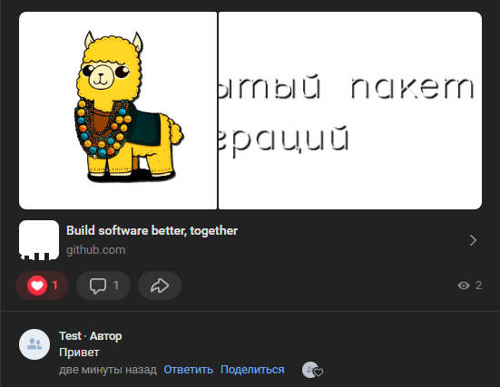

# Написать комментарий
Создает комментарий под выбранной записью

*Функция НаписатьКомментарий(Знач IDПоста, Знач IDСтены, Знач Текст, Знач Параметры = "") Экспорт*

  | Параметр | Тип | Назначение |
  |-|-|-|
  | IDПоста | Строка/Число | ID целеовго поста |
  | IDСтены | Строка/Число (необяз.) | ID стены, на которой расположен пост. По умолчанию - стена текущей группы |
  | Текст | Строка | Текст комментария |
  | Параметры | Структура (необяз.) | Параметры / перезапись стандартных параметров (см. [Получение необходимых данных](../)) |
  
  Вовзращаемое значение: Соответствие - сериализованный JSON ответа от VK

```bsl title="Пример кода"
			
	Ответ = OPI_VK.НаписатьКомментарий(221, -218861756, "Привет", Параметры);
	Ответ = OPI_Инструменты.JSONСтрокой(Ответ);

```


```json title="Результат"

{
 "response": {
  "parents_stack": [],
  "comment_id": 229
 }
}

```
