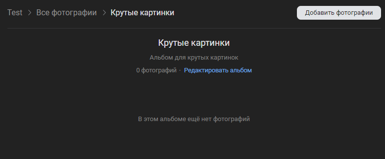

# Создать альбом
Создает альбом для хранения картинок

*Функция СоздатьАльбом(Знач Наименование, Знач Описание = "", Знач Параметры = "") Экспорт*

  | Параметр | CLI опция | Тип | Назначение |
  |-|-|-|-|
  | Наименование | --title | Строка | Наименование альбома |
  | Описание | --description | Строка (необяз.) | Описание альбома |
  | Параметры | --auth | Структура (необяз.) | Параметры / перезапись стандартных параметров (см. [Получение необходимых данных](../)) |
  
  Вовзращаемое значение: Соответствие - сериализованный JSON ответа от VK

```bsl title="Пример кода"
	
	Ответ = OPI_VK.СоздатьАльбом("Крутые картинки", "Альбом для крутых картинок", Параметры);
	Ответ = OPI_Инструменты.JSONСтрокой(Ответ);

```

```sh title="Пример команд CLI"

    oint vk СоздатьАльбом --title "Крутые картинки" --description "Альбом для крутых картинок" --auth C:\auth.json

```



```json title="Результат"

{
 "response": {
  "upload_by_admins_only": 1,
  "updated": 1704614517,
  "thumb_id": 0,
  "description": "Альбом для крутых картинок",
  "can_upload": 1,
  "feed_has_pinned": 0,
  "feed_disabled": 0,
  "title": "Крутые картинки",
  "comments_disabled": 0,
  "size": 0,
  "created": 1704614517,
  "owner_id": -218861756,
  "id": 302428737
 }
}

```
