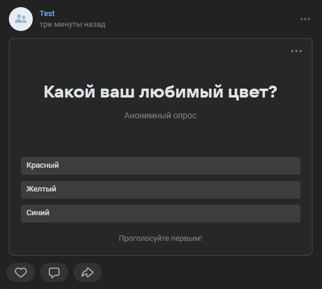

# Создать опрос
Создает опрос с вариантами ответа

*Функция СоздатьОпрос(Знач Вопрос, Знач МассивОтветов, Знач Картинка = "", Знач Параметры = "") Экспорт*

  | Параметр | CLI опция | Тип | Назначение |
  |-|-|-|-|
  | Вопрос | --question | Строка | Вопрос в опросе |
  | МассивОтветов | --options | Массив строк | Набор ответов на вопрос опроса |
  | Картинка | --picture | Строка/ДвоичныеДанные (необяз.) | Картинка фона опроса* |
  | Параметры | --auth | Структура (необяз.) | Параметры / перезапись стандартных параметров (см. [Получение необходимых данных](../)) |
  
  *Картинка на данный момент не подставляется. Мы смотрели запрос со службой поддержки, но найти причину не смогли
  
  Вовзращаемое значение: Соответствие - сериализованный JSON ответа от VK

```bsl title="Пример кода"
	
	МассивОтветов = Новый Массив;
	МассивОтветов.Добавить("Красный");
	МассивОтветов.Добавить("Желтый");
	МассивОтветов.Добавить("Синий");
	
	Ответ_ = OPI_VK.СоздатьОпрос("Какой ваш любимый цвет?"
		, МассивОтветов
		, "C:\logo.png"
		, VK_Параметры);

	Ответ  = OPI_Инструменты.JSONСтрокой(Ответ);

```

```sh title="Пример команд CLI"

    oint vk СоздатьОпрос --question "Какой ваш любимый цвет?" --options "['Красный','Желтый','Синий']" --picture "C:\alpaca.png" --auth C:\auth.json

```



```json title="Результат"

{
 "response": {
  "post_id": 225
 }
}

```
