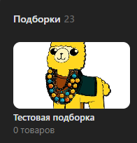

# Добавить подборку
Добавляет новую подборку

*Функция СоздатьПодборкуТоваров(Знач Название, Знач Картинка, Знач Основная = Ложь, Знач Скрытая = Ложь, Знач Параметры = "") Экспорт*

  | Параметр | CLI опция | Тип | Назначение |
  |-|-|-|-|
  | Название | --title | Строка | Название подборки |
  | Картинка | --picture | Строка, ДовичныеДанные | Путь или двоичные данные картинки |
  | Основная | --main | Булево (необяз.) | Делает подборку основной |
  | Скрытая | --hidden | Булево (необяз.) | Делает подборку скрытой |
  | Параметры | --auth | Структура (необяз.) | Параметры / перезапись стандартных параметров (см. [Получение необходимых данных](../)) |
  
  Вовзращаемое значение: Соответствие - сериализованный JSON ответа от VK

```bsl title="Пример кода"
	
    Ответ = OPI_VK.СоздатьПодборкуТоваров("Тестовая подборка"
        , Картинка
        , Истина
        , Ложь
        , Параметры);
            
    Ответ = OPI_Инструменты.JSONСтрокой(Ответ);

```



```json title="Результат"

{
 "response": {
  "albums_count": 23,
  "market_album_id": 39
 }
}

```
