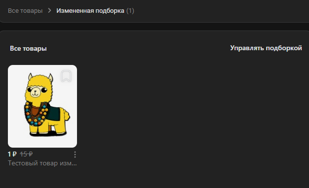

# Добавить товар в подборку
Добавляет товар в подборку

*Функция ДобавитьТоварВПодборку(Знач МассивТовар, Знач Подборка, Знач Параметры = "") Экспорт*

  | Параметр | CLI опция | Тип | Назначение |
  |-|-|-|-|
  | МассивТовар | --items | Строка, Число, Массив Из Строка,Число | ID товара или массив ID товаров |
  | Подборка | --sel | Строка,Число | ID подборки |
  | Параметры | --auth | Структура (необяз.) | Параметры / перезапись стандартных параметров (см. [Получение необходимых данных](../)) |
  
  Вовзращаемое значение: Соответствие - сериализованный JSON ответа от VK

```bsl title="Пример кода"
	
    Ответ = OPI_VK.ДобавитьТоварВПодборку(8656559, 40, Параметры);       
    Ответ = OPI_Инструменты.JSONСтрокой(Ответ);

```

```sh title="Пример команд CLI"

    oint vk ДобавитьТоварВПодборку --items "['8836187','8859921']" --sel 115 --auth C:\auth.json

```



```json title="Результат"

{
 "response": 1
}

```
