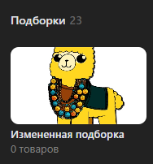

# Изменить подборку
Изменяет свойства существующей подборки

*Функция ИзменитьПодборкуТоваров(Знач Название, Знач Подборка, Знач Картинка = "", Знач Основная = Ложь, Знач Скрытая = Ложь, Знач Параметры = "") Экспорт*

  | Параметр | Тип | Назначение |
  |-|-|-|
  | Название | Строка | Название подборки |
  | Подборка | Строка, Число | ID подборки для изменения |
  | Картинка | Строка, ДовичныеДанные | Путь или двоичные данные картинки |
  | Основная | Булево (необяз.) | Делает подборку основной |
  | Скрытая | Булево (необяз.) | Делает подборку скрытой |
  | Параметры | Структура (необяз.) | Параметры / перезапись стандартных параметров (см. [Получение необходимых данных](../)) |
  
  Вовзращаемое значение: Соответствие - сериализованный JSON ответа от VK

```bsl title="Пример кода"
	
    Ответ = OPI_VK.ИзменитьПодборкуТоваров("Измененная подборка"
        , 40
        , Картинка
        , Истина
        , Ложь
        , Параметры);
            
    Ответ = OPI_Инструменты.JSONСтрокой(Ответ);

```



```json title="Результат"

{
 "response": 1
}

```
