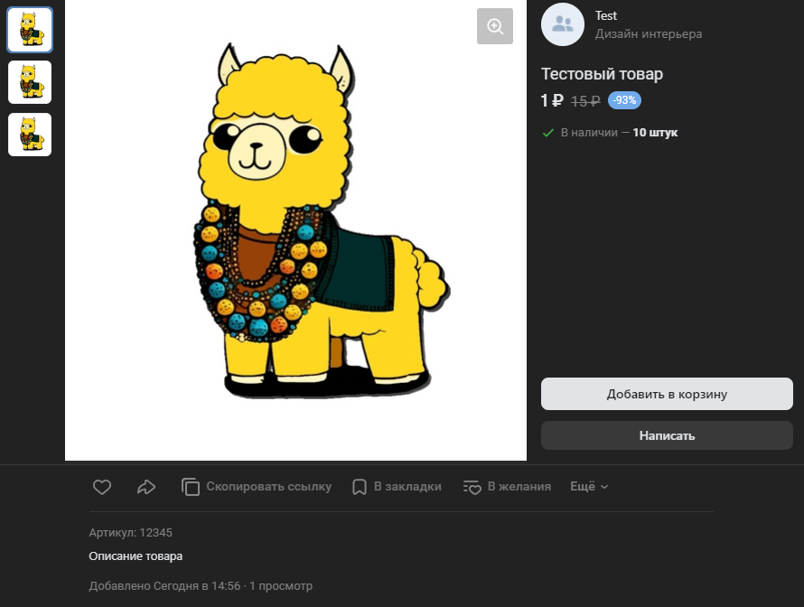

# Добавить товар
Добавляет новый товар

*Функция ДобавитьТовар(Знач ОписаниеТовара, Знач Подборка = "", Знач Параметры = "") Экспорт*

  | Параметр | Тип | Назначение |
  |-|-|-|
  | ОписаниеТовара | Соответствие | Описание создаваемого товара. См. [ПолучитьОписаниеТовара](./Poluchit-opisanye-tovara) |
  | Подборка | Строка, Число (необяз.) | ID подборки, в которую необходимо добавить товар, если необходимо|
  | Параметры | Структура (необяз.) | Параметры / перезапись стандартных параметров (см. [Получение необходимых данных](../)) |
  
  Вовзращаемое значение: Соответствие - сериализованный JSON ответа от VK

```bsl title="Пример кода"
	
    МассивКартинок = Новый Массив;
    МассивКартинок.Добавить(Картинка);
    МассивКартинок.Добавить(Картинка);
    
    Товар = Новый Соответствие();
    Товар.Вставить("Имя"                , "Тестовый товар");    
    Товар.Вставить("Описание"           , "Описание товара");
    Товар.Вставить("Категория"          , "20173");           
    Товар.Вставить("Цена"               , 1);                
    Товар.Вставить("СтараяЦена"         , 15);     
    Товар.Вставить("ОсновноеФото"       , Картинка);                   
    Товар.Вставить("URL"                , "https://github.com/Bayselonarrend/OpenIntegrations");     
    Товар.Вставить("ДополнительныеФото" , МассивКартинок);     
    Товар.Вставить("ГлавныйВГруппе"     , Истина);                 
    Товар.Вставить("Ширина"             , 20);     
    Товар.Вставить("Высота"             , 30);     
    Товар.Вставить("Глубина"            , 40);     
    Товар.Вставить("Вес"                , 100);
    Товар.Вставить("SKU"                , "12345");
    Товар.Вставить("ДоступныйОстаток"   , "10");
    
    Ответ = OPI_VK.ДобавитьТовар(Товар, ИДПодборки, Параметры);       
    Ответ = OPI_Инструменты.JSONСтрокой(Ответ);

```



```json title="Результат"

{
 "response": {
  "market_item_id": 8656047
 }
}

```
