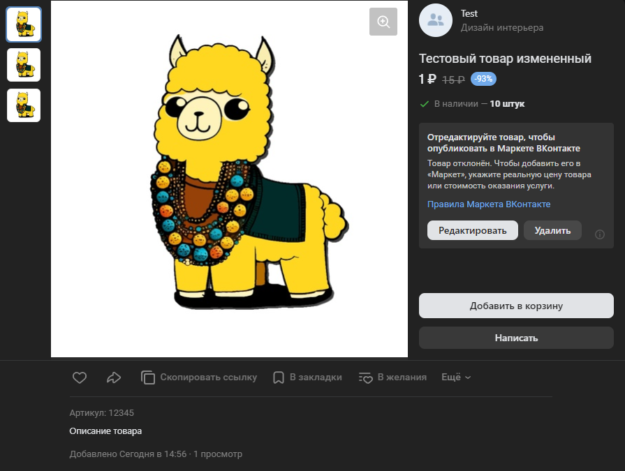

# Изменить товар
Изменяет ранее созданный товар

*Функция ИзменитьТовар(Знач Товар, Знач ОписаниеТовара, Знач Подборка = "", Знач Параметры = "") Экспорт*

  | Параметр | Тип | Назначение |
  |-|-|-|
  | Товар | Строка, Число | ID изменяемого товара |
  | ОписаниеТовара | Соответствие | Описание создаваемого товара. См. [ПолучитьОписаниеТовара](./Poluchit-opisanye-tovara) |
  | Подборка | Строка, Число (необяз.) | ID подборки, в которую необходимо добавить товар, если необходимо|
  | Параметры | Структура (необяз.) | Параметры / перезапись стандартных параметров (см. [Получение необходимых данных](../)) |
  
  Вовзращаемое значение: Соответствие - сериализованный JSON ответа от VK

```bsl title="Пример кода"
	
    Товар = Новый Соответствие;
    Товар.Вставить("Имя", "Тестовый товар измененный");
    
    Ответ = OPI_VK.ИзменитьТовар(ИДТовара, Товар, , Параметры);            
    Ответ = OPI_Инструменты.JSONСтрокой(Ответ);

```



```json title="Результат"

{
 "response": 1
}

```
