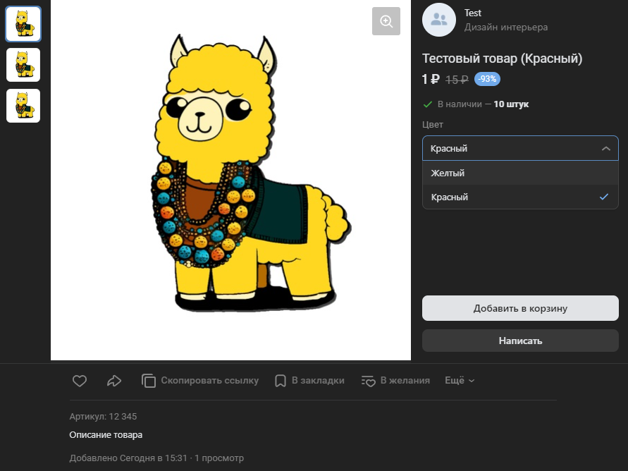

# Сгруппировать товары
Превращает несколько товаров в варианты одного товара на основе одинаковых свойств с разными значениями

*Функция СгруппироватьТовары(Знач МассивТоваров, Знач СуществующаяГруппа = "", Знач Параметры = "") Экспорт*

  | Параметр | CLI опция | Тип | Назначение |
  |-|-|-|-|
  | МассивТоваров | --items | Массив из Строка,Число | ID товаров |
  | СуществующаяГруппа | --sellgroup | Строка, Число (необяз.) | Для добавления товаров в существующу группу|
  | Параметры | --auth | Структура (необяз.) | Параметры / перезапись стандартных параметров (см. [Получение необходимых данных](../)) |
  
  Вовзращаемое значение: Соответствие - сериализованный JSON ответа от VK

```bsl title="Пример кода"
	     
    МассивТоваров = Новый Массив;
    МассивТоваров.Добавить(ИДЖелтогоТовара);
    МассивТоваров.Добавить(ИДКрасногоТовара);
    
    Ответ = OPI_VK.СгруппироватьТовары(МассивТоваров, , Параметры);
    Ответ = OPI_Инструменты.JSONСтрокой(Ответ);

```



```json title="Результат"

{
 "response": {
  "item_group_id": 5957
 }
}

```
