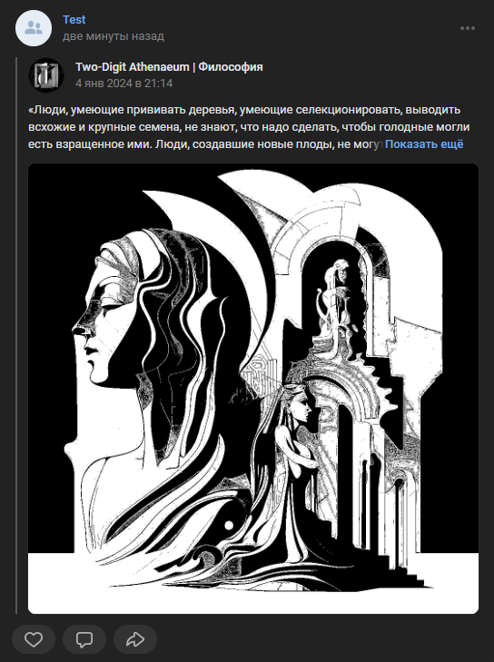

# Сделать репост
Делает репост записи

*Функция СделатьРепост(Знач IDПоста, Знач IDСтены = "", Знач ЦелеваяСтена = "", Знач Рекламный = Ложь, Знач Параметры = "") Экспорт*

  | Параметр | Тип | Назначение |
  |-|-|-|
  | IDПоста | Строка/Число | ID целеовго поста |
  | IDСтены | Строка/Число (необяз.) | ID стены, на которой расположен пост. По умолчанию - стена текущей группы |
  | ЦелеваяСтена | Строка/Число (необяз.) | ID стены, на которую нужно репостнуть запись. По умолчанию - стена текущей группы |
  | Рекламный | Булево (необяз.) | Пометить пост как рекламный. По умолчанию - Ложь |
  | Параметры | Структура (необяз.) | Параметры / перезапись стандартных параметров (см. [Получение необходимых данных](../)) |
  
  Вовзращаемое значение: Соответствие - сериализованный JSON ответа от VK

```bsl title="Пример кода"
			
	Ответ = OPI_VK.СделатьРепост(2571, -218704372, , , Параметры);
	Ответ = OPI_Инструменты.JSONСтрокой(Ответ);

```


```json title="Результат"

{
 "response": {
  "mail_repost_count": 2,
  "likes_count": 7,
  "reposts_count": 3,
  "post_id": 228,
  "badges": {
   "owner_id": -218704372,
   "id": 2571,
   "type": 11
  },
  "wall_repost_count": 1,
  "success": 1
 }
}

```
