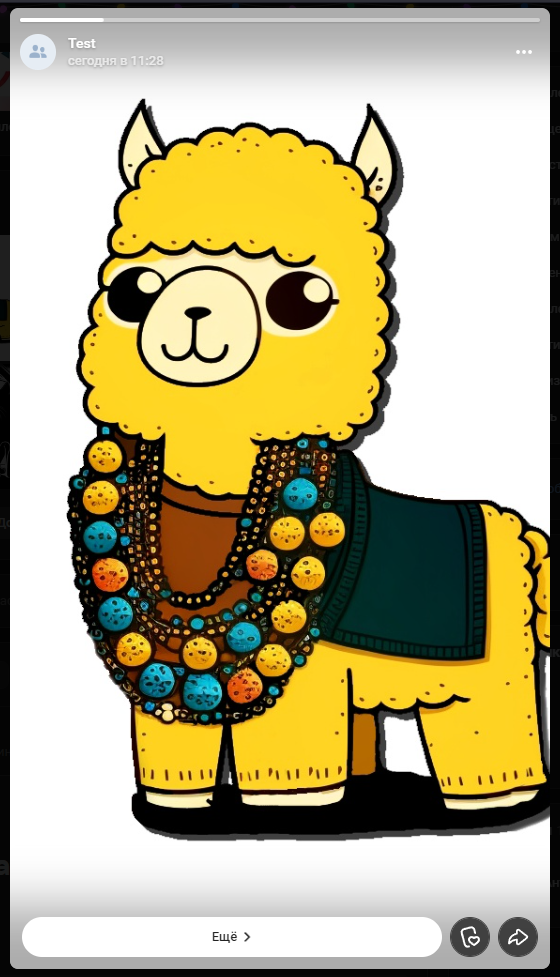

# Создать историю
Создает историю из картинки

*Функция СоздатьИсторию(Знач Картинка, Знач URL = "", Знач Параметры = "") Экспорт*

  | Параметр | Тип | Назначение |
  |-|-|-|
  | Картинка | Строка/ДвоичныеДанные | Двоичные данные или путь к картинке |
  | URL | Строка (необяз.) | URL для кнопки перехода под историей |
  | Параметры | Структура (необяз.) | Параметры / перезапись стандартных параметров (см. [Получение необходимых данных](../)) |
  
  Вовзращаемое значение: Соответствие - сериализованный JSON ответа от VK

```bsl title="Пример кода"
	
	Ответ = OPI_VK.СоздатьИсторию("C:\logo.png", "https://github.com/Bayselonarrend/OpenIntegrations", Параметры);
	Ответ = OPI_Инструменты.JSONСтрокой(Ответ);

```



```json title="Результат"

{
 "response": {
  "items": [
   {
    "can_use_in_narrative": true,
    "can_ask_anonymous": 0,
    "can_ask": 0,
    "views": 0,
    "type": "photo",
    "reaction_set_id": "reactions",
    "replies": {
     "new": 0,
     "count": 0
    },
    "no_sound": false,
    "photo": {
     "has_tags": false,
     "web_view_token": "9d566b4a60d8100666",
     "text": "",
     "sizes": [
      {
       "url": "https://sun56-1.userapi.com/s/v1/ig2/7PcNRex2pYue-SdgWSHnESz585ZQ_6r9stO9oJ3M_DrKI4Y7x4QJstCjexA7qH_enjYaK_fsZfqAqY1zsq9gBkRc.jpg?size=75x75&quality=95&type=story",
       "width": 75,
       "type": "s",
       "height": 75
      },
      {
       "url": "https://sun56-1.userapi.com/s/v1/ig2/sd2H9R-I3dlvzXoR8XLnyHnhemaAw9nvrcYVuvf3jhN_qBR7anO-_skKUvX50OrwQmfq3Kp73YejAt4IpgXHQ-BZ.jpg?size=130x130&quality=95&type=story",
       "width": 130,
       "type": "m",
       "height": 130
      },
      {
       "url": "https://sun56-1.userapi.com/s/v1/ig2/VKoQkcqGfGYqrSa-Q72CJvRvdP341pRAFaK4EVNjUX8BvoEO8bOOSrlbbSCPeBqMsY7NdaWnUNnG5F6-TOuYmih1.jpg?size=256x256&quality=95&type=story",
       "width": 256,
       "type": "j",
       "height": 256
      },
      {
       "url": "https://sun56-1.userapi.com/s/v1/ig2/O9JR0F_JQnIuNNURRqXmERhVbgg2A5KPV9Zgm8z2Jh0nPzCijHq-KqpA143HaMd1bBspqWR2Nz9m5vkEdKnvKxYw.jpg?size=604x604&quality=95&type=story",
       "width": 604,
       "type": "x",
       "height": 604
      },
      {
       "url": "https://sun56-1.userapi.com/s/v1/ig2/4NJSOtqS1-DUPrmCtrRNbY0NjGusmv6qeM945YnmnIPhFgbhxEojbKhN5BPN2Lrl5uJ0lgfSMolvdb9ifuyoNELu.jpg?size=807x807&quality=95&type=story",
       "width": 807,
       "type": "y",
       "height": 807
      },
      {
       "url": "https://sun56-1.userapi.com/s/v1/ig2/iGjh0lji0Vpji8BD3ikaquUg8L1SO2PYdjV9mk0STQW7Ce8hSp1aNlM09HwAlqXIWkCipWAHvuk8OBd9GjXX37gu.jpg?size=1024x1024&quality=95&type=story",
       "width": 1024,
       "type": "z",
       "height": 1024
      }
     ],
     "user_id": 100,
     "owner_id": -218861756,
     "id": 457239428,
     "date": 1704616101,
     "album_id": -81
    },
    "link": {
     "url": "https://github.com/Bayselonarrend",
     "text": "Ещё"
    },
    "track_code": "story/3AAQAdLy9G9EAs4bMafEA84nNfHkBAAFoAagB6AIAA==",
    "expires_at": 1704702501,
    "narratives_count": 0,
    "date": 1704616101,
    "likes_count": 0,
    "is_one_time": false,
    "can_share": 1,
    "can_like": true,
    "can_see": 1,
    "can_hide": 1,
    "can_reply": 1,
    "access_key": "story",
    "owner_id": -218861756,
    "can_comment": 1,
    "id": 456239044
   }
  ],
  "count": 1
 }
}

```
