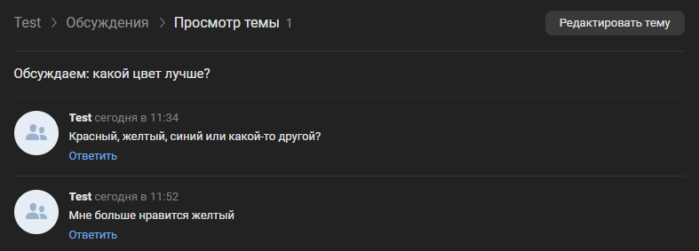

# Написать в обсуждение
Добавляет сообщение в обсуждение от имени группы

*Функция НаписатьВОбсуждение(Знач IDОбсуждения, Знач Текст, Знач Параметры = "") Экспорт*

  | Параметр | Тип | Назначение |
  |-|-|-|
  | IDОбсуждения | Строка/Число | ID целевого обсуждения |
  | Текст | Строка | Текст сообщения |
  | Параметры | Структура (необяз.) | Параметры / перезапись стандартных параметров (см. [Получение необходимых данных](../)) |
  
  Вовзращаемое значение: Соответствие - сериализованный JSON ответа от VK

```bsl title="Пример кода"
	
	Ответ = OPI_VK.НаписатьВОбсуждение(49494836, "Мне больше нравится желтый", Параметры);
	Ответ = OPI_Инструменты.JSONСтрокой(Ответ);

```



```json title="Результат"

{
 "response": 9
}

```
