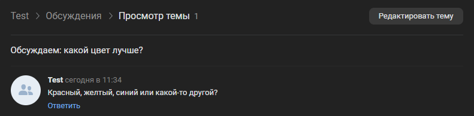

# Создать обсуждение
Создает новое обсуждение

*Функция СоздатьОбсуждение(Знач Наименование, Знач ТекстПервогоСообщения, Знач Параметры = "") Экспорт*

  | Параметр | Тип | Назначение |
  |-|-|-|
  | Наименование | Строка | Наименование обсуждения |
  | ТекстПервогоСообщения | Строка | Текст вводного сообщения обсуждения |
  | Параметры | Структура (необяз.) | Параметры / перезапись стандартных параметров (см. [Получение необходимых данных](../)) |
  
  Вовзращаемое значение: Соответствие - сериализованный JSON ответа от VK

```bsl title="Пример кода"
	
	Ответ = OPI_VK.СоздатьОбсуждение("Обсуждаем: какой цвет лучше?"
		, "Красный, желтый, синий или какой-то другой?"
		, Параметры);

	Ответ = OPI_Инструменты.JSONСтрокой(Ответ);

```



```json title="Результат"

{
 "response": 49494836
}

```
