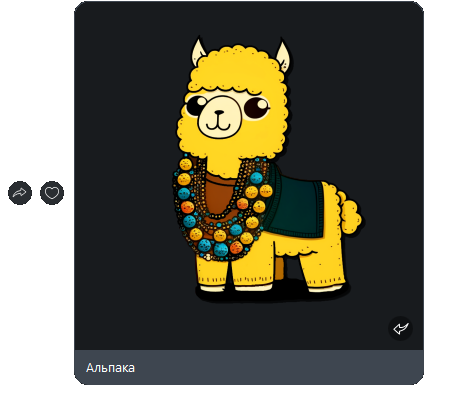

# Отправить картинку
Отправляет картинку в чат или канал


*Функция ОтправитьКартинку(Знач Токен, Знач URL, Знач IDПользователя, Знач ОтправкаВКанал, Знач Описание = "") Экспорт*

  | Параметр | CLI опция | Тип | Назначение |
  |-|-|-|-|
  | Токен | --token | Строка | Токен канала/бота |
  | URL | --picture | Строка | Адрес картинки |
  | IDПользователя | --user | Строка | IDПользователя: для канала - администратора, для бота - получателя |
  | ОтправкаВКанал | --ischannel | Булево | Истина - отправка в канал, Ложь - через бота |
  | Описание | --description | Строка (необяз.) | Аннотация к картинке |
  
  Вовзращаемое значение: Соответствие - сериализованный JSON ответа от Viber

```bsl title="Пример кода"
	
	ТокенКанала      = "523b58ba82afffaa-111111111111111-2222222222222222";
	IDПользователя   = "tMNGh111111111D+bT4g==";
	
	Ответ = OPI_Viber.ОтправитьКартинку(ТокенКанала, "https://api.athenaeum.digital/logo.png", IDПользователя, Истина, "Альпака"); //Соответствие
	Ответ = OPI_Инструменты.JSONСтрокой(Ответ);                                                                                    //JSON строка
	
```


```json title="Результат"

{
 "chat_hostname": "SN-CHAT-12_",
 "message_token": 5925484936191962157,
 "status_message": "ok",
 "status": 0
}

```
