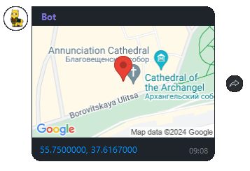

# Отправить локацию
Отправляет геолокацию по широте и долготе


*Функция ОтправитьЛокацию(Знач Токен, Знач Широта, Знач Долгота, Знач IDПользователя, Знач ОтправкаВКанал) Экспорт*

  | Параметр | CLI опция | Тип | Назначение |
  |-|-|-|-|
  | Токен | --token | Строка | Токен канала/бота |
  | Широта | --lat | Строка/Число | Географическая широта |
  | Долгота | --long | Строка/Число | Географическая долгота |
  | IDПользователя | --user | Строка | IDПользователя: для канала - администратора, для бота - получателя |
  | ОтправкаВКанал | --ischannel | Булево | Истина - отправка в канал, Ложь - через бота |
  
  Вовзращаемое значение: Соответствие - сериализованный JSON ответа от Viber

```bsl title="Пример кода"
	
	ТокенБота      = "523b5b25ed27e6ec-111111111111111-2222222222222222";
	IDПользователя = "d3jxe1111111111jYGgZg==";
	
	Ответ = OPI_Viber.ОтправитьЛокацию(ТокенБота, "55.75", "37.6167", IDПользователя, Ложь); //Соответствие
	Ответ = OPI_Инструменты.JSONСтрокой(Ответ);                                              //JSON строка
	
```


```json title="Результат"

{
 "billing_status": 1,
 "chat_hostname": "SN-CHAT-10_",
 "message_token": 5925751017338988046,
 "status_message": "ok",
 "status": 0
}

```
