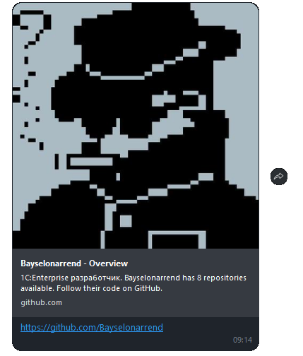

# Отправить ссылку
Отправляет URL в чат или канал


*Функция ОтправитьСсылку(Знач Токен, Знач URL, Знач IDПользователя, Знач ОтправкаВКанал) Экспорт*

  | Параметр | CLI опция | Тип | Назначение |
  |-|-|-|-|
  | Токен | --token | Строка | Токен канала/бота |
  | URL | --url | Строка | URL для отправки |
  | IDПользователя | --user | Строка | IDПользователя: для канала - администратора, для бота - получателя |
  | ОтправкаВКанал | --ischannel | Булево | Истина - отправка в канал, Ложь - пользователю|
  
  Вовзращаемое значение: Соответствие - сериализованный JSON ответа от Viber

```bsl title="Пример кода"
	
	ТокенБота      = "523b5b25ed27e6ec-111111111111111-2222222222222222";
	IDПользователя = "d3jxe1111111111jYGgZg==";
	
	Ответ = OPI_Viber.ОтправитьСсылку(ТокенБота, "https://github.com/Bayselonarrend", IDПользователя, Ложь); //Соответствие
	Ответ = OPI_Инструменты.JSONСтрокой(Ответ);                                                              //JSON строка
	
```

```sh title="Пример команд CLI"

    oint viber ОтправитьСсылку --token %token% --url "https://github.com/Bayselonarrend" --user %user% --ischannel false

```



```json title="Результат"

{
 "billing_status": 1,
 "chat_hostname": "SN-CHAT-15_",
 "message_token": 5925752472607291800,
 "status_message": "ok",
 "status": 0
}

```
