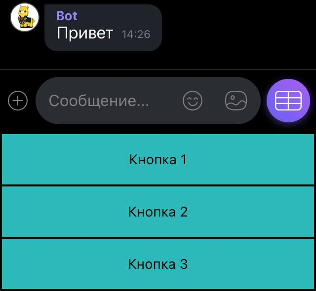

# Отправить текстовое сообщение
Отправляет текстовое сообщение в чат или канал


*Функция ОтправитьТекстовоеСообщение(Знач Токен, Знач Текст, Знач IDПользователя, Знач ОтправкаВКанал, Знач Клавиатура = "") Экспорт*

  | Параметр | Тип | Назначение |
  |-|-|-|
  | Токен | Строка | Токен канала/бота |
  | Текст | Строка | Текст сообщения |
  | IDПользователя | Строка | IDПользователя: для канала - администратора, для бота - получателя |
  | ОтправкаВКанал | Булево | Истина - отправка в канал, Ложь - пользователю|
  | Клавиатура | Строка (необяз.) | JSON клавиатуры (для чат-ботов). См. [Сформировать клавиатуру по массиву кнопок](./%D0%A1%D1%84%D0%BE%D1%80%D0%BC%D0%B8%D1%80%D0%BE%D0%B2%D0%B0%D1%82%D1%8C%20%D0%BA%D0%BB%D0%B0%D0%B2%D0%B8%D0%B0%D1%82%D1%83%D1%80%D1%83%20%D0%BF%D0%BE%20%D0%BC%D0%B0%D1%81%D1%81%D0%B8%D0%B2%D1%83%20%D0%BA%D0%BD%D0%BE%D0%BF%D0%BE%D0%BA) |
  
  Вовзращаемое значение: Соответствие - сериализованный JSON ответа от Viber

```bsl title="Пример кода"
	
	ТокенБота      = "523b5b25ed27e6ec-111111111111111-2222222222222222";
	IDПользователя = "d3jxe1111111111jYGgZg==";
	
	МассивКнопок = Новый Массив;
	
	МассивКнопок.Добавить("Кнопка 1");
	МассивКнопок.Добавить("Кнопка 2");
	МассивКнопок.Добавить("Кнопка 3");
		
	Клавиатура = OPI_Viber.СформироватьКлавиатуруИзМассиваКнопок(МассивКнопок);
	
	Ответ = OPI_Viber.ОтправитьТекстовоеСообщение(ТокенБота, "Привет", IDПользователя, Ложь, Клавиатура); //Соответствие
	Ответ = OPI_Инструменты.JSONСтрокой(Ответ);                                                             //JSON строка
	
```


```json title="Результат"

{
 "chat_hostname": "SN-CHAT-10_",
 "message_token": 5925400810709476620,
 "status_message": "ok",
 "status": 0
}

```
