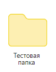

# Создать папку
Создает каталог на Диске

*Функция СоздатьПапку(Знач Токен, Знач Путь) Экспорт*

  | Параметр | CLI опция | Тип | Назначение |
  |-|-|-|-|
  | Токен | --token | Строка | Токен доступа |
  | Путь | --path | Строка | Путь создания папки |
  
  Вовзращаемое значение: Соответствие - сериализованный JSON ответа от Yandex

```bsl title="Пример кода"
			
    Токен = "y0_AgAAAABdylaOAA...";   
    Путь  = "/Тестовая папка"
    Ответ = OPI_YandexDisk.СоздатьПапку(Токен, Путь); //Соответствие
    Ответ = OPI_Инструменты.JSONСтрокой(Ответ);       //Строка

```



```json title="Результат"

{
 "revision": 1707461457546792,
 "comment_ids": {
  "public_resource": "1573541518:ba32b9efac79ab1b04707a4278a1ff583d7b0403ea306035f1b910e56c6ef3ac",
  "private_resource": "1573541518:ba32b9efac79ab1b04707a4278a1ff583d7b0403ea306035f1b910e56c6ef3ac"
 },
 "path": "disk:/Тестовая папка",
 "modified": "2024-02-09T06:50:57+00:00",
 "created": "2024-02-09T06:50:57+00:00",
 "resource_id": "1573541518:ba32b9efac79ab1b04707a4278a1ff583d7b0403ea306035f1b910e56c6ef3ac",
 "type": "dir",
 "name": "Тестовая папка",
 "exif": {},
 "_embedded": {
  "total": 0,
  "path": "disk:/Тестовая папка",
  "limit": 20,
  "offset": 0,
  "items": [],
  "sort": ""
 }
}

```
