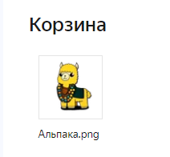

# Удалить объект
Удаляет или помещает в корзину объект Диска

*Функция УдалитьОбъект(Знач Токен, Знач Путь, Знач ВКорзину = Истина) Экспорт*

  | Параметр | CLI опция | Тип | Назначение |
  |-|-|-|-|
  | Токен | --token | Строка | Токен доступа |
  | Путь | --path | Строка | Путь к объекту на Диске |
  | ВКоризну | --can | Булеов(необяз.) | Истина - помещает в корзину, Ложь - удаляет навсегда |
  
  Вовзращаемое значение: Соответствие - сериализованный JSON ответа от Yandex

```bsl title="Пример кода"
			
    Токен = "y0_AgAAAABdylaOAA...";   
    Путь  = "/Альпака.png"
    Ответ = OPI_YandexDisk.УдалитьОбъект(Токен, Путь);  //Соответствие
    Ответ = OPI_Инструменты.JSONСтрокой(Ответ);         //Строка

```

```sh title="Пример команд CLI"

    oint yadisk УдалитьОбъект --token %token% --path "/Альпака.png" --can false

```




```json title="Результат"

<пустая строка>

```
