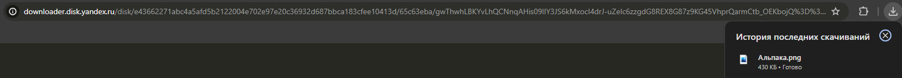

# Получить ссылку скачивания публичного объекта
Получает прямую ссылку для скачивания объекта в общем доступе

*Функция ПолучитьСсылкуСкачиванияПубличногоОбъекта(Знач Токен, Знач URL, Знач Путь = "") Экспорт*

  | Параметр | CLI опция | Тип | Назначение |
  |-|-|-|-|
  | Токен | --token | Строка | Токен доступа |
  | URL | --url | Строка | URL публичного объекта |
  | Путь | --path | Строка (необяз.) | Путь к файлу внутри публичной папки (если необходимо) |
  
  Вовзращаемое значение: Соответствие - сериализованный JSON ответа от Yandex

```bsl title="Пример кода"
			
    Токен = "y0_AgAAAABdylaOAA...";   
    URL   = "https://disk.yandex.by/i/txwzakUVtxgjoQ"

    Ответ = OPI_YandexDisk.ПолучитьСсылкуСкачиванияПубличногоОбъекта(Токен, URL);   //Соответствие
    Ответ = OPI_Инструменты.JSONСтрокой(Ответ);                                     //Строка

```



```json title="Результат"

{
 "templated": false,
 "method": "GET",
 "href": "https://downloader.disk.yandex.ru/disk/e43662271abc4a5afd5b2122004e702e97e20c36932d687bbca183cfee10413d/65c63eba/gwThwhLBKYvLhQCNnqAHis09lIY3JS6kMxocI4drJ-uZelc6zzgdG8REX8G87z9KG45VhprQarmCtb_OEKbojQ%3D%3D?uid=0&filename=%D0%90%D0%BB%D1%8C%D0%BF%D0%B0%D0%BA%D0%B0.png&disposition=attachment&hash=O%2BtgG9OfyuyJgwBRM%2BBJVaHN3Kg0nH8yi5xbEKU3m%2Bd8vVVsZCwR%2BLHB8oeN%2BwcTq/J6bpmRyOJonT3VoXnDag%3D%3D%3A&limit=0&content_type=image%2Fpng&owner_uid=1573541518&fsize=440431&hid=0e9b208e1aea0dbd58b4b43ccdc3ad5a&media_type=image&tknv=v2"
}

```
