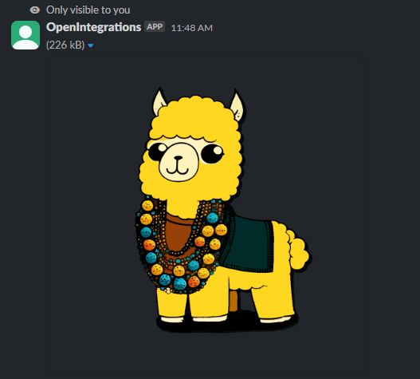

---
sidebar_position: 2
---

# Отправить эфемерное сообщение
Отправляет сообщение, которое приходит в канал, но видно только конкретному пользователю


*Функция ОтправитьЭфемерноеСообщение(Знач Токен, Знач Канал, Знач Текст = "", Знач Пользователь = "", Знач Блоки = "") Экспорт*

  | Параметр | CLI опция | Тип | Назначение |
  |-|-|-|-|
  | Токен | --token | Строка | Токен бота |
  | Канал | --channel | Строка | Идентификатор канала |
  | Текст | --text | Строка | Текст сообщения |
  | Пользователь | --user | Строка | ID пользователя |
  | Блоки | --blocks | Массив Из Структура | JSON массива описаний блоков |

  
  Вовзращаемое значение:   Соответствие Из КлючИЗначение - сериализованный JSON ответа от Slack

```bsl title="Пример кода"
	
  Канал = "C070VPMKN8J";
  Блок  = OPI_Slack.СформироватьБлокКартинку("https://opi.neocities.org/test_data/picture.jpg", "Картинка");

  Ответ = OPI_Slack.ОтправитьЭфемерноеСообщение(Токен, Канал, , Пользователь, Блок); //Соответствие
  Ответ = OPI_Инструменты.JSONСтрокой(Ответ);                                        //JSON строка
	
```

```sh title="Пример команд CLI"
    
    oint slack СформироватьБлокКартинку --picture "https://opi.neocities.org/test_data/picture.jpg" --alt "Картинка" --out block.json
    oint slack ОтправитьЭфемерноеСообщение --token %token% --channel %channel% --user %user% --blocks block.json

```



```json title="Результат"

{
 "ok": true,
 "message_ts": "1714146540.000300"
}

```
