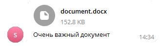

# Отправить документ
Отправляет документ в чат или канал


*Функция ОтправитьДокумент(Знач Токен, Знач IDЧата, Знач Текст, Знач Документ, Знач Клавиатура = "") Экспорт*

  | Параметр | CLI опция | Тип | Назначение |
  |-|-|-|-|
  | Токен | --token | Строка | Токен бота |
  | IDЧата | --chat | Строка/Число | ID целевого чата. Если необходима отправка в определенную тему, её номер нужно указывать через * (IDЧата*IDТемы) |
  | Текст | --text | Строка | Текст сообщения |
  | Документ | --doc | Двоичные данные / Строка | Двоичные данные картинки или путь к документу |
  | Клавиатура | --keyboard | Строка (необяз.) | JSON клавиатуры. См. [Сформировать клавиатуру по массиву кнопок](./Sformirovat-klaviaturu-po-massivu-knopok) |
  | Разметка | --parsemode | Строка (необяз.) | Вид обработки текста (HTML, Markdown, MarkdownV2). Markdown по умолчанию |
  
  Вовзращаемое значение: Соответствие - сериализованный JSON ответа от Telegram


```bsl title="Пример кода"
	
	Токен           = "111111111:AACccNYOAFbuhAL5GAaaBbbbOjZYFvLZZZZ";
	Описание        = "Очень важный документ";
	ПутьКДокументу  = "C:\1.docx";
	
	Ответ = OPI_Telegram.ОтправитьДокумент(Токен, 1234567890, Описание, ПутьКДокументу); //Соответствие
	Ответ = OPI_Инструменты.JSONСтрокой(Ответ);                                          //JSON строка                                            
	
```

```sh title="Пример команд CLI"

    oint telegram ОтправитьДокумент --token "%token%" --chat %channelid% --text "Очень важный документ" --doc "C:\1.docx"

```



```json title="Результат"

{
 "result": {
  "caption": "Очень важный документ",
  "document": {
   "file_size": 156479,
   "file_unique_id": "AgADRTsAAlUVyUg",
   "file_id": "BQACAgIAAxkDAAMaZZk66eGouWpSt-5uhU-RHp6zTKAAAkU7AAJVFclIHgAB8tPqM0BjNAQ",
   "mime_type": "application/vnd.openxmlformats-officedocument.wordprocessingml.document",
   "file_name": "document.docx"
  },
  "date": 1704540905,
  "chat": {
   "username": "JKIee",
   "type": "private",
   "last_name": "Titowets",
   "first_name": "Anton",
   "id": 1234567890
  },
  "from": {
   "username": "sicheebot",
   "first_name": "Sichee",
   "is_bot": true,
   "id": 0987654321
  },
  "message_id": 26
 },
 "ok": true
}

```
