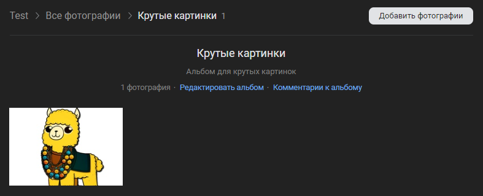

# Сохранить картинку в альбом
Сохраняет картинку в альбом сообщества

*Функция СохранитьКартинкуВАльбом(Знач IDАльбома, Знач Картинка, Знач Описание = "", Знач Параметры = "") Экспорт*

  | Параметр | CLI опция | Тип | Назначение |
  |-|-|-|-|
  | IDАльбома | --album | Строка/Число | ID альбома для сохранения |
  | Картинка | --picture | Строка/ДвоичныеДанные | Двоичные данные или путь к картинке |
  | Описание | --description | Строка | Аннотация к картинке |
  | Параметры | --auth | Структура (необяз.) | Параметры / перезапись стандартных параметров (см. [Получение необходимых данных](../)) |
  
  Вовзращаемое значение: Соответствие - сериализованный JSON ответа от VK

```bsl title="Пример кода"
	
	Ответ = OPI_VK.СохранитьКартинкуВАльбом(302277649
			, "C:\logo.png"
			, "Альпака"
			, Параметры);
			
	Ответ = OPI_Инструменты.JSONСтрокой(Ответ);

```

```sh title="Пример команд CLI"

    oint vk СохранитьКартинкуВАльбом --album 302277649 --picture "C:\alpaca.png" --description "Альпака" --auth C:\auth.json

```



```json title="Результат"

{
 "response": [
  {
   "has_tags": false,
   "web_view_token": "12796bb38e311b43bd",
   "text": "Альпака",
   "sizes": [
    {
     "url": "https://sun9-58.userapi.com/impg/hAVBXBVJJm-Yek5fk9c2Quby4Cecd1nwRu9BvQ/708zjL4tJEc.jpg?size=75x75&quality=96&sign=ceec370f4b791ccdf911277c89df5ba6&c_uniq_tag=N1fdAY5-MDCyCyrI3LFFHbOs3_eFK1Na_4vZGTLduhs&type=album",
     "width": 75,
     "type": "s",
     "height": 75
    },
    {
     "url": "https://sun9-58.userapi.com/impg/hAVBXBVJJm-Yek5fk9c2Quby4Cecd1nwRu9BvQ/708zjL4tJEc.jpg?size=130x130&quality=96&sign=6310c8f17ea4d623297d99de7bcb0a02&c_uniq_tag=TYbUzidaEDaxszfawnM0qs0_mgP1y0VrV_oE4O0MDds&type=album",
     "width": 130,
     "type": "m",
     "height": 130
    },
    {
     "url": "https://sun9-58.userapi.com/impg/hAVBXBVJJm-Yek5fk9c2Quby4Cecd1nwRu9BvQ/708zjL4tJEc.jpg?size=604x604&quality=96&sign=7bb5422f0ee3090f1d35efec9f32408e&c_uniq_tag=xtj_A-t5ZN2UuO7A-Ddnb7kfjXVxndHCFp9U4me4vus&type=album",
     "width": 604,
     "type": "x",
     "height": 604
    },
    {
     "url": "https://sun9-58.userapi.com/impg/hAVBXBVJJm-Yek5fk9c2Quby4Cecd1nwRu9BvQ/708zjL4tJEc.jpg?size=807x807&quality=96&sign=bceed124270756e94f767c95b73dd402&c_uniq_tag=kNqj8dwDVw2ZsGXGf2JTvd0ReWo5ymUIKosHUKSmlYo&type=album",
     "width": 807,
     "type": "y",
     "height": 807
    },
    {
     "url": "https://sun9-58.userapi.com/impg/hAVBXBVJJm-Yek5fk9c2Quby4Cecd1nwRu9BvQ/708zjL4tJEc.jpg?size=1024x1024&quality=96&sign=525faab7ad4fe08c04b0dd3afef321c0&c_uniq_tag=eD0hnb1U0OMRPlSVjJtwYJO4sfqYXZYvAG1D7BzKbdo&type=album",
     "width": 1024,
     "type": "z",
     "height": 1024
    },
    {
     "url": "https://sun9-58.userapi.com/impg/hAVBXBVJJm-Yek5fk9c2Quby4Cecd1nwRu9BvQ/708zjL4tJEc.jpg?size=130x130&quality=96&sign=6310c8f17ea4d623297d99de7bcb0a02&c_uniq_tag=TYbUzidaEDaxszfawnM0qs0_mgP1y0VrV_oE4O0MDds&type=album",
     "width": 130,
     "type": "o",
     "height": 130
    },
    {
     "url": "https://sun9-58.userapi.com/impg/hAVBXBVJJm-Yek5fk9c2Quby4Cecd1nwRu9BvQ/708zjL4tJEc.jpg?size=200x200&quality=96&sign=b60c435efe1cafe2accde861f94291b0&c_uniq_tag=g2CyI4cOdrV6iB7bGfYWSlb_1zY1rvFrfuotsSBzV6Q&type=album",
     "width": 200,
     "type": "p",
     "height": 200
    },
    {
     "url": "https://sun9-58.userapi.com/impg/hAVBXBVJJm-Yek5fk9c2Quby4Cecd1nwRu9BvQ/708zjL4tJEc.jpg?size=320x320&quality=96&sign=7903b25c650df6e3349aa792156772f2&c_uniq_tag=fAe4uRSjDtPBF02FoLe7NXMGL6gHWJKHk5NWNEspVOI&type=album",
     "width": 320,
     "type": "q",
     "height": 320
    },
    {
     "url": "https://sun9-58.userapi.com/impg/hAVBXBVJJm-Yek5fk9c2Quby4Cecd1nwRu9BvQ/708zjL4tJEc.jpg?size=510x510&quality=96&sign=15860c63877741a2ea9125ede1b7262d&c_uniq_tag=CA3fCeEJvaW8L43J8-PYDtu7LC-tdEgvLpWCal-4Is0&type=album",
     "width": 510,
     "type": "r",
     "height": 510
    }
   ],
   "user_id": 100,
   "owner_id": -218861756,
   "id": 457239427,
   "date": 1704614930,
   "album_id": 302428737
  }
 ]
}

```
