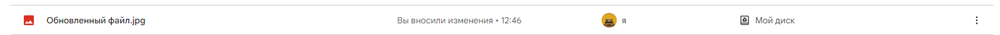

# Обновить файл
Обновляет двоичные данные существующего файла

*Функция ОбновитьФайл(Знач Токен, Знач Идентификатор, Знач Файл, Знач НовоеИмя = "") Экспорт*

  | Параметр | CLI опция | Тип | Назначение |
  |-|-|-|-|
  | Токен | --token | Строка | Токен доступа |
  | Идентификатор | --object | Строка | ID копируемого объекта |
  | Файл | --file | ДвоичныеДанные,Строка | Двоичные данные или путь к новым данным |
  | НовоеИмя | --title | Строка (необяз.) | Новое имя файла |
  
  Вовзращаемое значение: Соответствие - сериализованный JSON ответа от Google

```bsl title="Пример кода"

    НовоеИмя          = "Обновленный файл.jpeg";
    КартинкаЗамены    = "C:\OPI\image2.jpg";
    Идентификатор     = "1V0oaZh3qQZ7-wbARC8-vrErAFllsBGSJ";
    
    Ответ = OPI_GoogleDrive.ОбновитьФайл(Токен, Идентификатор, КартинкаЗамены, НовоеИмя)  //Соответствие
    Ответ = OPI_Инструменты.JSONСтрокой(Ответ);                                           //Строка

```

```sh title="Пример команд CLI"

    oint google ОбновитьТокен --id %clientid% --secret %clientsecret% --refresh %refreshtoken% > token.json
    oint tools РазложитьJSON --json token.json --name access_token > token.tmp
    set /p token=<token.tmp
    oint gdrive ОбновитьФайл --token "%token%" --object "1V0oaZh3qQZ7-wbARC8-vrErAFllsBGSJ" --file "C:\AlpcaDisk.png" --title "Обновленный файл.jpeg" 

```



```json title="Результат"

{
 "mimeType": "image/jpeg",
 "name": "Обновленный файл.jpg",
 "id": "1V0oaZh3qQZ7-wbARC8-vrErAFllsBGSJ",
 "kind": "drive#file"
}

```
