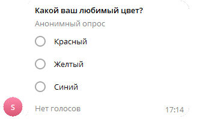

# Отправить опрос
Отправляет опрос с вариантами ответа


*Функция ОтправитьОпрос(Знач Токен, Знач IDЧата, Знач Вопрос, Знач МассивОтветов, Знач Анонимный = Истина) Экспорт*

  | Параметр | CLI опция | Тип | Назначение |
  |-|-|-|-|
  | Токен | --token | Строка | Токен бота |
  | IDЧата | --chat | Строка/Число | ID целевого чата. Если необходима отправка в определенную тему, её номер нужно указывать через * (IDЧата*IDТемы) |
  | Вопрос | --question | Строка | Заголовок опроса |
  | МассивОтветов | --options | Массив из Строка | Массив строк вариантов ответов |
  | Анонимный | --anonymous | Булевно (необяз.) | Анонимный опроса. Неанонимные опросы в каналах не разрешены |
  
  Вовзращаемое значение: Соответствие - сериализованный JSON ответа от Telegram


```bsl title="Пример кода"
	
	Токен         = "111111111:AACccNYOAFbuhAL5GAaaBbbbOjZYFvLZZZZ";
	МассивОтветов = Новый Массив;
	МассивОтветов.Добавить("Красный");
	МассивОтветов.Добавить("Желтый");
	МассивОтветов.Добавить("Синий");

	Ответ = OPI_Telegram.ОтправитьОпрос(Токен, 1234567890, "Какой ваш любимый цвет?", МассивОтветов) //Соответствие
	Ответ = OPI_Инструменты.JSONСтрокой(Ответ);                                                      //JSON строка
	
```

```sh title="Пример команд CLI"

    oint telegram ОтправитьОпрос --token "%token%" --chat %channelid% --question "Какой ваш любимый цвет?" --options "['Красный','Желтый','Синий']"

```



```json title="Результат"

{
 "result": {
  "date": 1704550537,
  "chat": {
   "username": "JKIee",
   "type": "private",
   "last_name": "Titowets",
   "first_name": "Anton",
   "id": 1234567890
  },
  "poll": {
   "allows_multiple_answers": false,
   "is_anonymous": true,
   "is_closed": false,
   "total_voter_count": 0,
   "options": [
    {
     "voter_count": 0,
     "text": "Красный"
    },
    {
     "voter_count": 0,
     "text": "Желтый"
    },
    {
     "voter_count": 0,
     "text": "Синий"
    }
   ],
   "type": "regular",
   "question": "Какой ваш любимый цвет?",
   "id": "5244746695866059262"
  },
  "from": {
   "username": "sicheebot",
   "first_name": "Sichee",
   "is_bot": true,
   "id": 0987654321
  },
  "message_id": 32
 },
 "ok": true
}

```
