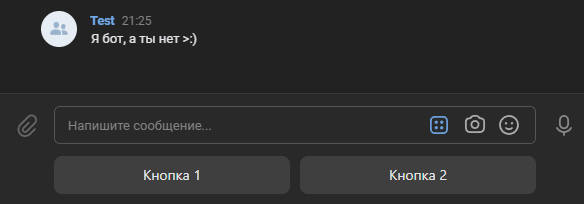

# Сформировать клавиатуру
Сформировать клавиатуру из массива кнопок

*Функция СформироватьКлавиатуру(Знач МассивКнопок) Экспорт*

  | Параметр | CLI опция | Тип | Назначение |
  |-|-|-|-|
  | МассивКнопок | --buttons | Массив из Строка | Массив кнопок |
  
  Вовзращаемое значение: Строка - сокращенный URL

```bsl title="Пример кода"
			
	МассивКнопок = Новый Массив;
	МассивКнопок.Добавить("Кнопка 1");
	МассивКнопок.Добавить("Кнопка 2");                     
	
	Клавиатура = OPI_VK.СформироватьКлавиатуру(МассивКнопок);
	КТ         = "vk1.a.IzbBGUkYUvrNfMt_sknCcC66hyYifL0U1Bb8CVYC...";
	Ответ      = OPI_VK.НаписатьСообщение("Я бот, а ты нет >:)", 657846756, КТ, Клавиатура, Параметры); 
	
	Ответ = OPI_Инструменты.JSONСтрокой(Ответ);

```

```sh title="Пример команд CLI"

    oint vk СформироватьКлавиатуру --buttons "['Кнопка 1','Кнопка 2']"

```



```json title="Результат"

{
 "buttons": [
  [
   {
    "action": {
     "type": "text",
     "label": "Кнопка 1"
    }
   },
   {
    "action": {
     "type": "text",
     "label": "Кнопка 2"
    }
   }
  ]
 ],
 "one_time": false
}

```
