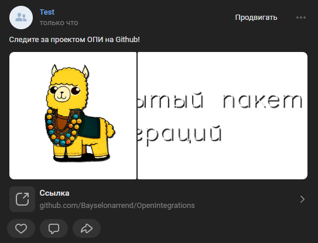

# Создать пост
Создает пост с картинками

*Функция СоздатьПост(Знач Текст, Знач МассивКартинок, Знач Рекламный = Ложь, Знач СсылкаПодЗаписью = "", Знач Параметры = "") Экспорт*

  | Параметр | CLI опция | Тип | Назначение |
  |-|-|-|-|
  | Текст | --text | Строка | Непосредственно текст поста |
  | МассивКартинок | --pictures | Массив строк, Массив Двоичных данных | Массив двоичных данны или путей к картинкам поста|
  | Рекламный | --ad | Булево (необяз.) | Пометить пост как рекламу. По умолчанию - Ложь |
  | СсылкаПодЗаписью | --url | Строка (необяз.) | URL, отображаемый под постом, ели необходим |
  | Параметры | --auth | Структура (необяз.) | Параметры / перезапись стандартных параметров (см. [Получение необходимых данных](../)) |
  
  Вовзращаемое значение: Соответствие - сериализованный JSON ответа от VK

```bsl title="Пример кода"
	
	МассивКартинок = Новый Массив;
	МассивКартинок.Добавить("C:\alpaca.png");
	МассивКартинок.Добавить("C:\logo_long.png");
	
	Ответ = OPI_VK.СоздатьПост("Следите за проектом ОПИ на Github!"
		, МассивКартинок
		, Ложь
		, "https://github.com/Bayselonarrend/OpenIntegrations"
		, Параметры);
	
	Ответ  = OPI_Инструменты.JSONСтрокой(Ответ);

```

```sh title="Пример команд CLI"

    oint vk СоздатьПост --text "Следите за проектом ОПИ на Github!" --pictures "['C:\alpaca.png','C:\logo_long.png']" --url "https://github.com/Bayselonarrend/OpenIntegrations" --auth C:\auth.json

```



```json title="Результат"

{
 "response": {
  "post_id": 221
 }
}

```
