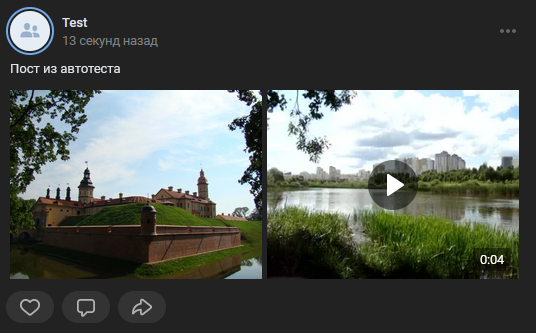

# Создать составной пост
Создает пост на основе массива вложений

*Функция СоздатьПост(Знач Текст, Знач Объекты, Знач Реклама = Ложь, Знач СсылкаПодЗаписью = "", Знач Параметры = "") Экспорт*

  | Параметр | CLI опция | Тип | Назначение |
  |-|-|-|-|
  | Текст | --text | Строка | Непосредственно текст поста |
  | Объекты | --objects | Массив из Строка |  Массив идентификаторов вида photo123_123 |
  | Реклама | --ad | Булево (необяз.) | Пометить пост как рекламу. По умолчанию - Ложь |
  | СсылкаПодЗаписью | --url | Строка (необяз.) | URL, отображаемый под постом, ели необходим |
  | Параметры | --auth | Структура (необяз.) | Параметры / перезапись стандартных параметров (см. [Получение необходимых данных](../)) |
  
  Вовзращаемое значение: Соответствие - сериализованный JSON ответа от VK

```bsl title="Пример кода"
	
	
    СсылкаПодЗаписью = "https://github.com/Bayselonarrend/OpenIntegrations";

    Текст    = "Пост из автотеста";
    Видео    = Новый ДвоичныеДанные("C:\video.mp4");
    Картинка = Новый ДвоичныеДанные("C:\alpaca.png");
	
    ЗагрузкаКартинки = OPI_VK.ЗагрузитьФотоНаСервер(Картинка, Параметры)["response"][0];
    ЗагрузкаВидео    = OPI_VK.ЗагрузитьВидеоНаСервер(Видео, "Новое видео", , , Параметры);
    
    ВладелецКартинки = OPI_Инструменты.ЧислоВСтроку(ЗагрузкаКартинки["owner_id"]);
    ВладелецВидео    = OPI_Инструменты.ЧислоВСтроку(ЗагрузкаВидео["owner_id"]);
    
    IDКартинки       = OPI_Инструменты.ЧислоВСтроку(ЗагрузкаКартинки["id"]);
    IDВидео          = OPI_Инструменты.ЧислоВСтроку(ЗагрузкаВидео["video_id"]);
    
    МассивВложений = Новый Массив;
    МассивВложений.Добавить("photo" + ВладелецКартинки + "_" + IDКартинки);
    МассивВложений.Добавить("video" + ВладелецВидео + "_" + IDВидео);
    
    Ответ = OPI_VK.СоздатьСоставнойПост(Текст, МассивВложений, Ложь, СсылкаПодЗаписью, Параметры);  // Соответствие
    Ответ = OPI_Инструменты.JSONСтрокой(Ответ);                                                     // Строка

```

```sh title="Пример команд CLI"

    oint vk СоздатьСоставнойПост --text "Пост из автотеста" --objects "['photo123_123','video_123123']" --url "https://github.com/Bayselonarrend/OpenIntegrations" --auth C:\auth.json

```



```json title="Результат"

{
 "response": {
  "post_id": 222
 }
}

```
