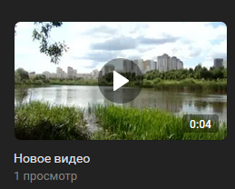

---
sidebar_position: 9
---

# Загрузить видео
 Загружает видео в группу


*Функция ЗагрузитьВидео(Знач Видео, Знач Наименование, Знач Описание = "", Знач Альбом = "", Знач Параметры = "") Экспорт*

  | Параметр | CLI опция | Тип | Назначение |
  |-|-|-|-|
  | Видео | --file | Строка, ДвоичныеДанные | Файл видео |
  | Наименование | --title | Строка | Наименование видео |
  | Описание | --description | Строка | Описание видео |
  | Альбом | --album | Строка | ID альбома, если необходимо |
  | Параметры | --auth | Структура из Строка | JSON авторизации или путь к .json |

  
  Вовзращаемое значение:   Соответствие Из КлючИЗначение - сериализованный JSON ответа от VK 

```bsl title="Пример кода"
	
  Наименование = "Новое видео";
  Описание     = "Описание видео";
  Видео        = Новый ДвоичныеДанные("C:/video.mp4");

  Ответ = OPI_VK.ЗагрузитьВидео(Видео, Наименование, Описание, , Параметры); //Соответствие
  Ответ = OPI_Инструменты.JSONСтрокой(Ответ);                                //JSON строка
	
```

```sh title="Пример команд CLI"
    
  oint vk ЗагрузитьВидео --file "C:/video.mp4" --title "Новое видео" --description "Описание видео" --auth C:\auth.json

```



```json title="Результат"


```
