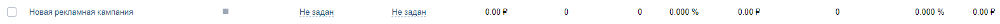

# Создать рекламную кампанию
Создает кампанию в выбранном рекламном кабинете

*Функция СоздатьРекламнуюКампанию(Знач IDКабинета, Знач Наименование, Знач Параметры = "") Экспорт*

  | Параметр | CLI опция | Тип | Назначение |
  |-|-|-|-|
  | IDКабинета | --cabinet | Строка/Число | Номер кабинета из настроек https://vk.com/ads?act=settings |
  | Наименование | --title | Строка | Наименование кампании |
  | Параметры | --auth | Структура (необяз.) | Параметры / перезапись стандартных параметров (см. [Получение необходимых данных](../)) |
  
  Вовзращаемое значение: Соответствие - сериализованный JSON ответа от VK

```bsl title="Пример кода"
			
	Ответ = OPI_VK.СоздатьРекламнуюКампанию(1234567890, "Новая рекламная кампания", Параметры);
	Ответ = OPI_Инструменты.JSONСтрокой(Ответ);

```

```sh title="Пример команд CLI"

    oint vk СоздатьРекламнуюКампанию --cabinet %cabinet% --title "Новая рекламная кампания" --auth C:\auth.json

```



```json title="Результат"

{
 "response": [
  {
   "id": 1029701085
  }
 ]
}

```
