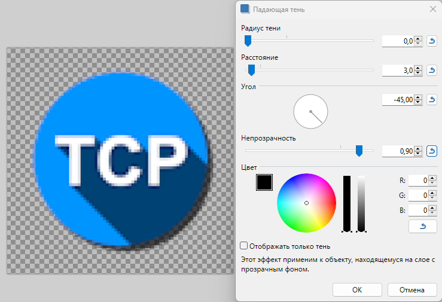

# Заметки по работе с картинками

+ Иконки API
    + В Readme
        + Полотно 80x80 из 64x64 изображения
        + Тени
            + Радиус 0
            + Растояние 3
            + Непрозрачность 0,9

            
    + В документации
        + Большая 64x64
        + Маленькая (сайдбар) 24x24
